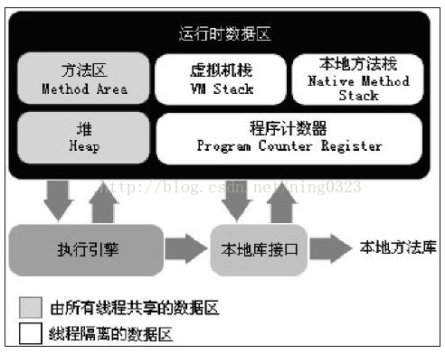

### 运行时数据区  
《Java虚拟机规范（JavaSE7版）》规定Java虚拟机管理的内存包括以下几个运行时数据区域：   

  

- 程序计数器
线程私有，内存空间较小，可看做当前线程执行字节码（分支、循环、跳转、异常处理、线程恢复）的行号指示器  

若执行Java方法则计数器记录字节码指令地址，若执行Native方法则计数器为Undefined  

无OutOfMemaryError情况  

- 虚拟机栈  

线程私有，生命周期与线程相同   

描述Java方法执行的内存模型：一个方法执行时创建一个栈帧存储局部变量表、操作数栈、动态链接、方法出口等信息  

方法调用、执行过程对应栈帧入栈、出栈过程。  

局部变量表存放编译期可知的基本数据类型、对象引用和returnAddress类型，所需内存空间在编译期完成分配，方法运行时大小不变  

有StackOverflowError、OutOfMemaryError异常   

- 本地方法栈  

与虚拟机栈相似，区别是虚拟机栈为执行Java方法服务、本地方法栈为执行Native方法服务  
 
虚拟机规范中对此区域无强制规定，Sun Hotspot虚拟机将本地方法栈、虚拟机栈合二为一  

- 堆  

线程共享，内存空间最大，虚拟机启动时创建，存放对象实例  

垃圾收集器管理的主要区域，可细分为新生代、老年代，新生代可再细分为Eden、From Survive、To Survive空间  

从内存分配角度看，可划分出多个线程私有分配缓冲区  

不要求物理上连续，要求逻辑上连续，可选择固定大小或可扩展  

有OutOfMemaryError异常  

- 方法区  

线程共享，存储已被虚拟机加载的类信息、常量、静态变量、即时编译器编译后的代码等数据  

对于Hotspot可称为永久代，其他虚拟机无此说法，JDK1.7 Hotspot已把存放于永久代的的字符串常量池移出  

不要求物理上连续，要求逻辑上连续，可选择固定大小或可扩展。  

有OutOfMemaryError异常  

JDK8后，永久代被移到与一个堆不相连的本地内存区域，也即就是元空间，由于类的元数据分配在本地内存中，元空间的最大可分配空间就是系统可用内存空间。  

JDK8永久代向元空间的转换的原因：  

1、字符串存在永久代中，容易出现性能问题和内存溢出。  
2、类及方法的信息等比较难确定其大小，因此对于永久代的大小指定比较困难，太小容易出现永久代溢出，太大则容易导致老年代溢出。  
3、永久代会为 GC 带来不必要的复杂度，并且回收效率偏低。  
4、Oracle 可能会将HotSpot 与 JRockit 合二为一。  

- 运行时常量池  

方法区的一部分。存放已加载Class文件中的常量池（符号引用、直接引用）  

具备动态性，运行期间可存入新常量，如String.intern()：Java查找常量池中是否有相同Unicode的字符串常量，如果有，则返回其的引用，如果没有，则在常量池中增加一个Unicode等于str的字符串并返回它的引用   

jdk8中，运行时常量池和静态变量都存储到了堆中，MetaSpace存储类的元数据，MetaSpace直接申请在本地内存中（Native memory）,这样类的元数据分配只受本地内存大小的限制,OOM问题就不存在了  

#### 直接内存  

非虚拟机运行时数据区，Java虚拟机规范中未定义  

有OutOfMamaryError异常  

使用Native函数库分配堆外内存，可避免在Java堆和Native堆间来回复制数据  

使用场景：  

- 有很大的数据需要存储，它的生命周期很长  
- 适合频繁的IO操作，例如网络并发场景  