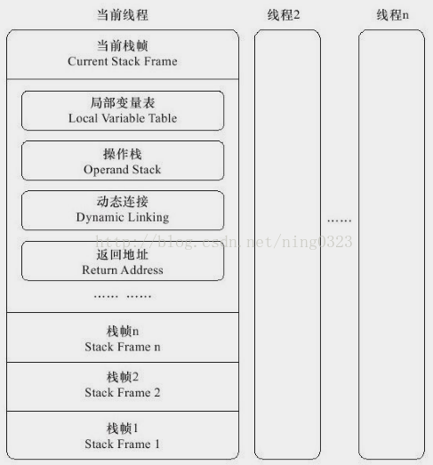
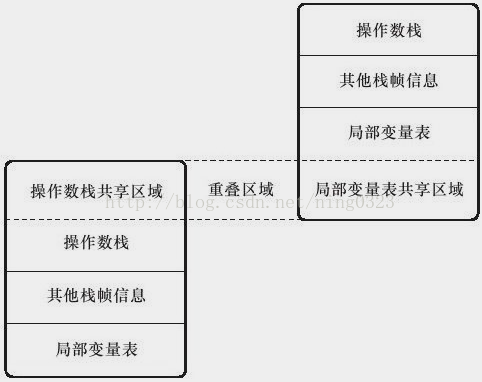

### 运行时栈帧结构  
用于支持虚拟机进行方法调用和方法执行的数据结构，是虚拟机栈（Virtual Machine Stack）的栈元素  
存储方法的局部变量表、操作数栈、动态连接和方法返回地址等信息  
每个方法从调用开始至执行完成，对应一个栈帧从入栈到出栈  
编译程序代码时，栈帧大小已完全确定，故一个栈帧需分配多少内存，不受程序运行期变量数据影响，仅取决于具体虚拟机实现  
对于执行引擎，在活动线程中只有栈顶栈帧有效，称当前栈帧（Current Stack Frame），字节码指令只操作当前栈帧  
与当前栈帧关联的方法称当前方法（Current Method）  
  

#### 局部变量表（Local Variable Table）  
一组变量值存储空间，存放方法参数和方法内部定义的局部变量  
容量以变量槽（Variable Slot，下称Slot）为最小单位，Class文件中Code属性的max_locals数据项确定该表最大容量  
每个Slot能存放一个boolean、byte、char、short、int、float、reference或returnAddress类型数据  
64位的long和double类型数据，以高位对齐方式占2个连续Slot，局部变量表建立在线程的堆栈上，是线程私有数据，无论读写两个连续Slot是否为原子操作，都不会引起数据安全问题  
虚拟机通过索引定位方式使用局部变量表，索引值范围从0至最大Slot数量  
方法执行时，虚拟机使用局部变量表完成参数值到参数变量列表的传递过程  
若执行实例方法（非static方法），则局部变量表中0位索引Slot默认传递方法所属对象实例引用，即"this"，其余参数按参数表顺序从1开始排列，参数表分配完毕后，根据方法体内定义变量顺序和作用域分配其余Slot  
为节省栈帧空间Slot可重用，方法体中定义的局部变量作用域不一定覆盖整个方法体，若当前字节码PC计数器的值已超出某变量作用域，则该变量对应Slot可交给其他变量使用，但这样的设计会伴随一些副作用  
定义了局部变量但是未赋值是不能使用的  

#### 操作数栈（Operand Stack）  
也称操作栈，是一个后入先出（Last In First Out, LIFO）栈  
Class文件中Code属性的max_stacks数据项确定该栈最大深度  
32位数据类型占栈容量为1，64位数据类型占栈容量为2  
概念模型中两个栈帧完全独立，但大多虚拟机实现会做优化处理，使两个栈帧出现部分重叠，这样，在进行方法调用时可共用一部分数据，无须额外参数复制传递  
  

Java虚拟机解释执行引擎称为“基于栈的执行引擎”，其中的“栈”就是操作数栈  

#### 动态链接  
每个栈帧都包含一个指向运行时常量池中该栈帧所属方法的引用，持有该引用是为了支持方法调用过程中的动态连接（Dynamic Linking）  
Class文件的常量池中存有大量符号引用，该符号引用会作为方法调用指令的参数  
这些符号引用一部分会在类加载阶段或第一次使用时转为直接引用，称静态解析  
另外一部分在每次运行期间转为直接引用，称动态连接  

#### 方法返回地址  
方法开始执行后有两种退出方式：  
1) 正常完成出口（Normal Method Invocation Completion），执行引擎遇到方法返回指令，方法返回指令决定是否有返回值传递给上层方法调用者  
2) 异常完成出口（Abrupt Method Invocation Completion），方法执行过程中遇到异常，且该异常未在方法体内处理，无论是Java虚拟机内部的异常，还是athrow指令产生的异常，只要在该方法异常表中未搜索到匹配异常处理器，就会导致方法退出，这时不会有返回值传递给上层方法调用者  
无论以何种方式退出，都需返回到方法被调用位置，程序才能继续执行，方法返回时可能需要在栈帧中保存一些信息，用来帮助恢复上层方法的执行状态：  
1) 方法正常退出时，调用者PC计数器的值可作为返回地址，栈帧中可能会保存这个计数器值  
2) 方法异常退出时，返回地址由异常处理器表决定，栈帧中一般不会保存这部分信息  

方法退出过程实际上等同于当前栈帧出栈，故退出时可能执行的操作有：  
1) 恢复上层方法局部变量表和操作数栈  
2) 把返回值（如果有）压入调用者栈帧操作数栈  
3) 调整PC计数器的值以指向方法调用指令后面一条指令  

#### 附加信息  
虚拟机规范允许具体虚拟机实现在栈帧中增加一些规范中未描述的信息，如调试相关信息  

实际开发中，一般会把动态连接、方法返回地址、其他附加信息归为一类，称栈帧信息  