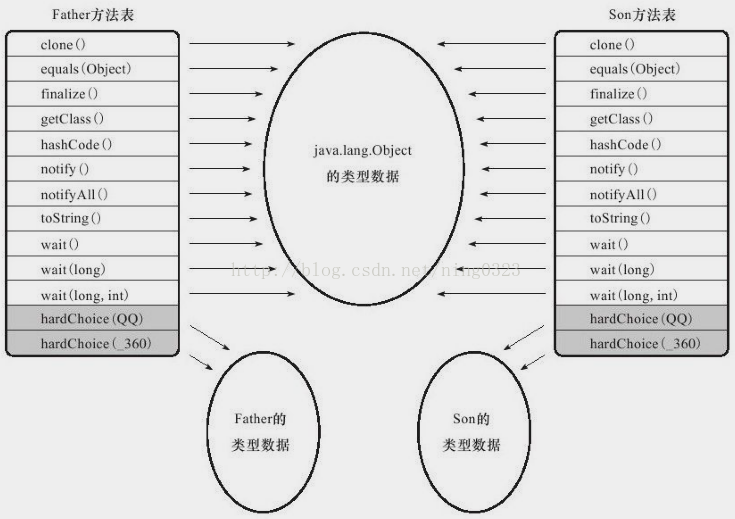

### 方法调用  
方法调用不等同于方法执行，方法调用阶段唯一任务是确定被调用方法的版本（即调用哪一个方法），不涉及方法内部具体运行过程  
Class文件编译过程不包含连接步骤，方法调用在Class文件中存储的是符号引用，不是方法实际运行时内存布局入口地址（相当于直接引用）  
该特性给Java带来更强大的动态扩展能力，但也使Java方法调用过程变得相对复杂，需要在类加载、甚至运行期间才能确定目标方法的直接引用  

#### 解析调用  
是一个静态的过程  
类加载的解析阶段会将Class文件中一部分方法符号引用解析为直接引用，该解析成立的前提是：“编译期可知，运行期不可变”，即  
1) 方法在程序真正运行前就有一个可确定调用版本  
2) 且该方法的调用版本在运行期不可变  
符合以上要求的方法，主要包括静态方法、私有方法，前者与类型直接关联，后者在外部不可被访问  
以上2种方法各自的特点决定了它们不可能通过继承或其他方式重写其他版本，故它们适合在类加载阶段进行解析  
对应的5条方法调用指令：  
1) invokestatic：调用静态方法  
2) invokespecial：调用实例构造器＜init＞方法、私有方法和父类方法  
3) invokevirtual：调用所有的虚方法  
4) invokeinterface：调用接口方法，在运行时再确定一个实现此接口的对象  
5) invokedynamic：先在运行时动态解析出调用点限定符所引用的方法，然后再执行该方法  
前4条指令的分派逻辑固化在Java虚拟机内部，invokedynamic指令的分派逻辑由用户设定的引导方法决定  
能被invokestatic、invokespecial指令调用的（4种）方法，可在解析阶段确定唯一调用版本，这些方法称为非虚方法，其他方法称为虚方法（除去final方法）  
final方法使用invokevirtual指令调用，但它无法被覆盖，无其他版本，故无须对方法接收者进行多态选择，Java语言规范明确说明final方法是非虚方法  

#### 分派(Dispatch)调用  
可能是静态或动态的过程  
分派调用过程会揭示多态性特征的一些最基本体现，如“重载”、“重写”，在Java虚拟机中是如何实现的，即虚拟机如何确定正确的目标方法  
方法的接收者与参数统称为方法的宗量  
根据分派依据的宗量数可分为单分派、多分派，2类分派方式两两组合构成静态单分派、静态多分派、动态单分派、动态多分派4种分派组合  

- 静态分派  

所有依赖静态类型定位方法执行版本的分派动作称为静态分派  
典型应用是方法重载（Overload）  
静态分派发生在编译阶段，故确定静态分派动作实际上不是由虚拟机执行的  
```
Human man = new Man();
```  
上面代码中"Human"称为变量的静态类型（Static Type），或外观类型（Apparent Type），"Man"称为变量的实际类型（Actual Type）
静态类型和实际类型在程序中都可发生变化，区别是：  
a. 静态类型仅在使用时发生变化，变量本身的静态类型不会被改变，且最终静态类型在编译期可知  
b. 实际类型变化的结果在运行期才可知  
使用哪个重载版本，完全取决于传入参数的数量和数据类型  
虚拟机（准确地说是编译器）在重载时通过参数的静态类型而非实际类型作为判定依据  
静态类型在编译期可知，故在编译阶段编译器会根据参数的静态类型决定使用的方法重载版本，并把该方法的符号引用写到invokevirtual指令的参数中  

编译器虽能确方法的重载版本，但该重载版本并不一定“唯一”，此时只能确定一个“更加合适的”版本  
产生以上模糊结论的主要原因是字面量不需要定义，故字面量无显式的静态类型，它的静态类型只能通过语言规则去理解和推断  
自动转型匹配重载优先级：  
char＞int＞long＞float＞double > 自动装箱 > 自动装箱类的父类或接口 > Object > 变长参数（变长参数中无法自动转型）  
不会匹配到byte、short类型的重载，因为char到byte、short的转型不安全  
编译器无法确定自动转型类型时会提示类型模糊，拒绝编译  

```
/**
 * 重载方法匹配优先级
 */
public class Overload {
    public static void sayHello(char arg) {
        System.out.println(" hello char");
    }
    public static void sayHello(int arg) {
        System.out.println(" hello int");
    }
    public static void sayHello(long arg) {
        System.out.println(" hello long");
    }
    public static void sayHello(float arg) {
        System.out.println(" hello float");
    }
    public static void sayHello(double arg) {
        System.out.println(" hello double");
    }
    public static void sayHello(Character arg) {
        System.out.println(" hello Character");
    }
    public static void sayHello(Serializable arg) {
        System.out.println(" hello Serializable");
    }
    public static void sayHello(Object arg) {
        System.out.println(" hello Object");
    }
    public static void sayHello(char... arg) {
        System.out.println(" hello char……");
    }
    public static void main(String[] args) {
        sayHello('a');
    }
}

```  

- 动态分派  

在运行期根据实际类型确定方法执行版本的分派过程称为动态分派  
典型应用是方法重写（Override）  
invokevirtual指令多态查找过程，即运行时解析过程步骤：  
1) 找到操作数栈顶第一个元素指向的对象的实际类型，记作C  
2) 在类型C中查找是否有与常量中的描述符和简单名称都相符的方法，若无则3)，若有则进行访问权限校验，若通过则返回该方法的直接引用，查找过程结束，若不通过则返回java.lang.IllegalAccessError异常  
3) 按继承关系从下往上依次对C的父类进行第2步的搜索和验证过程  
4) 若最终未找到合适的方法，则抛出java.lang.AbstractMethodError异常  

```
/**
 * 方法动态分派演示
 */
public class DynamicDispatch {
    static abstract class Human {
        protected abstract void sayHello();
    }
    static class Man extends Human {
        @Override
        protected void sayHello() {
            System.out.println("man say hello");
        }
    }
    static class Woman extends Human {
        @Override
        protected void sayHello() {
            System.out.println("woman say hello");
        }
    }
    public static void main(String[] args) {
        Human man = new Man();
        Human woman = new Woman();
        man.sayHello();
        woman.sayHello();
        man = new Woman();
        man.sayHello();
    }
}

```  

#### 单分派与多分派  

单分派是根据一个宗量对目标方法进行选择  
多分派是根据多个宗量对目标方法进行选择  
今天（直至还未发布的Java1.8）的Java语言是一门静态多分派、动态单分派的语言  
目前Java语言没有直接变为动态语言的发展趋势，而是通过内置动态语言（如JavaScript）执行引擎的方式来满足动态性的需求  
但Java虚拟机在JDK1.7中实现的JSR-292中已经开始支持动态语言，新增的invokedynamic指令成为了最复杂的一条方法调用指令  

```
/**
 * 单分派、多分派演示
 */
public class DynamicDispatch {
    static class QQ {
    }
    static class _360{
    }
    public static class Father {
        public void hardChoice(QQ arg) {
            System.out.println("father choose qq");
        }
        public void hardChoice(_360 arg) {
            System.out.println("father choose 360");
        }
    }
    public static class Son extends Father {
        public void hardChoice(QQ arg) {
            System.out.println("son choose qq");
        }
        public void hardChoice(_360 arg) {
            System.out.println("son choose 360");
        }
    }
    public static void main(String[] args) {
        Father father = new Father();
        Father son = new Son();
        father.hardChoice(new _360());
        son.hardChoice(new QQ());
    }
}

```  

#### 虚拟机动态分派的实现  
动态分派动作频繁，且需运行时在方法元数据中搜索合适目标方法，故虚拟机实现基于性能考虑，大部分不会真正进行如此频繁的搜索  
面对以上情况，最常用“稳定优化”手段是，为类在方法区建立虚方法表（Vritual Method Table，称vtable，invokeinterface执行时会用到接口方法表—Inteface Method Table，称itable），使用虚方法表索引代替元数据查找以提高性能  
方法表中存放各方法实际入口地址  
若子类未重写方法，则子类方法表中的地址和父类方法表中相同方法的地址一致指向父类的实现入口  
若子类重写了方法，则子类方法表中的地址为指向子类实现版本的入口地址  
为程序实现方便，具有相同签名的方法，在父类、子类的方法表中具有相同索引序号  
当类型变换时，仅需变更方法表即可从不同方法表中按索引转换出所需的入口地址  
方法表一般在类加载的连接阶段进行初始化，准备了类的变量初始值后，虚拟机会把该类的方法表也初始化完毕  

  
虚拟机除使用方法表外，在条件允许时，还会使用内联缓存（Inline Cache）和基于“类型继承关系分析”（Class Hierarchy Analysis, CHA）技术的守护内联（Guarded Inlining）两种非稳定的“激进优化”手段来获得更高性能  