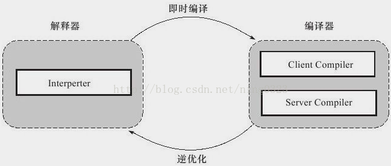
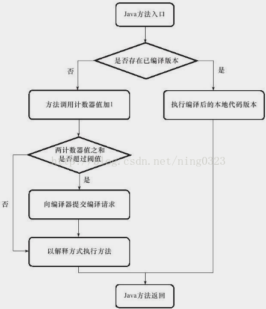
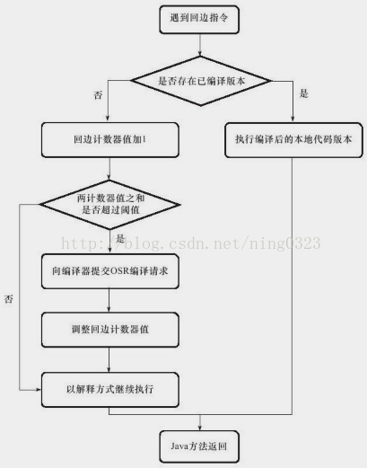
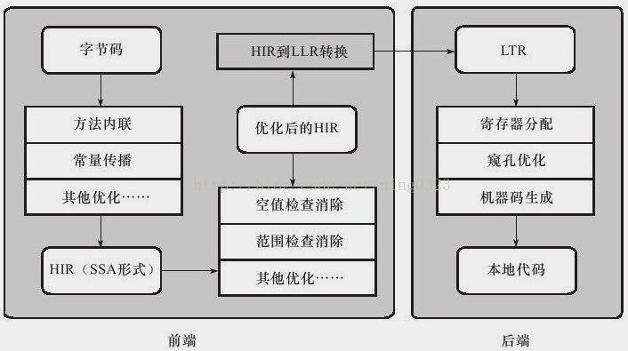

### HotSpot虚拟机内的即时编译器  
热点代码和JIT编译器  
Java程序最初通过解释器（Interpreter）进行解释执行，虚拟机发现某个方法或代码块运行特别频繁时，会把这些代码认定为“热点代码”（Hot Spot Code）  
为提高热点代码执行效率，虚拟机运行时会把热点代码编译成与本地平台相关的机器码，并进行各种层次的优化，完成这个任务的编译器称即时编译器（Just In Time Compiler，下文称JIT编译器）  
JIT编译器不是虚拟机的必需部分，但JIT编译器编译性能的好坏、代码优化程度的高低是衡量一款商用虚拟机优秀与否的最关键的指标之一，也是虚拟机中最核心且最能体现虚拟机技术水平的部分  

#### 为何HotSpot虚拟机要使用解释器与JIT编译器并存的架构？  
解释器与JIT编译器两者各有优势：  
程序需要迅速启动和执行时，解释器可首先发挥作用，省去编译时间，立即执行  
程序运行后，随着时间推移，JIT编译器逐渐发挥作用，把越来越多的代码编译成本地代码后，可获取更高执行效率  
程序运行环境中内存资源限制较大（如部分嵌入式系统中），可使用解释执行节约内存，反之可使用JIT编译执行提升效率  
解释器还可作为JIT编译器激进优化时的一个“逃生门”，让编译器根据概率选择一些大多数时候都能提升运行速度的优化手段，当激进优化的假设不成立时可通过逆优化（Deoptimization）退回到解释状态继续执行  
故，在整个虚拟机执行架构中解释器与编译器经常配合工作  
  

#### 为何HotSpot虚拟机要实现两个不同的JIT编译器？  
HotSpot内置2个JIT编译器，Client Compiler（C1编译器）和Server Compiler（C2编译器、Opto编译器）  
主流HotSpot（Sun系列JDK1.7及之前版本虚拟机）默认采用解释器与一个JIT编译器直接配合方式工作  
具体使用哪个JIT编译器取决于虚拟机运行模式，HotSpot会根据自身版本与宿主机器硬件性能自动选择运行模式  
用户可使用"-client"或"-server"参数强制虚拟机运行在Client或Server模式  

解释器与JIT编译器搭配使用方式在虚拟机中称“混合模式”（Mixed Mode）  
用户可使用参数"-Xint"强制虚拟机运行于“解释模式”（Interpreted Mode），这时JIT编译器完全不介入工作  
用户可使用参数"-Xcomp"强制虚拟机运行于“编译模式”（Compiled Mode），这时将优先采用JIT编译方式执行程序，但解释器仍要在编译无法进行时介入执行过程  
注，在最新Sun HotSpot中已去掉"-Xcomp"参数  

由于JIT编译器编译本地代码需占用程序运行时间，编译出优化程度更高的代码花费时间可能更长，且，解释器可能要替JIT编译器收集性能监控信息，这会影响解释执行速度  
为在程序启动响应速度与运行效率之间达到最佳平衡，HotSpot会逐渐启用分层编译（Tiered Compilation）策略  
分层编译根据JIT编译器编译、优化的规模与耗时，划分不同编译层次，包括：  
第0层，解释执行，解释器不开启性能监控功能（Profiling），可触发第1层编译  
第1层，也称C1编译，将字节码编译为本地代码，进行简单、可靠的优化，若有必要会加入性能监控逻辑  
第2层（或2层以上），也称C2编译，将字节码编译为本地代码，会启用一些编译耗时较长的优化，甚至会根据性能监控信息进行一些不可靠的激进优化  
实施分层编译后，Client Compiler和Server Compiler会同时工作，许多代码都可能会被多次编译  
用Client Compiler获取更高的编译速度，用Server Compiler获取更好的编译质量，在解释执行时无须再承担收集性能监控信息任务  

注，  
分层编译在JDK1.7的Server模式中作为默认编译策略被开启，在JDK1.7前需使用-XX:+TieredCompilation参数手动开启  
若不开启分层编译策略，而虚拟机又运行在Server模式，Server Compiler需要的性能监控信息可由解释器收集  

#### 程序何时使用解释器执行？何时使用JIT编译器执行？  
“热点代码”分2类：  

- 被多次调用的方法  
以整个方法作为编译对象，虚拟机中标准的JIT编译方式  
- 被多次执行的循环体  
以整个方法而不是单独循环体作为编译对象，因编译发生在方法执行过程中，故称栈上替换编译（On Stack Replacement，OSR编译）  

判断一段代码是不是热点代码，是不是需要触发即时编译，的行为称热点探测（Hot Spot Detection）  
2种热点探测：  

- 基于采样的热点探测（Sample Based Hot Spot Detection）  
虚拟机周期性地检查各线程栈顶，若发现某个（或某些）方法经常出现在栈顶，则该方法是“热点方法”  
好处，实现简单、高效，可很容易地获取方法调用关系（将调用堆栈展开即可）  
缺点，很难精确地确认一个方法的热度，容易被线程阻塞或其他外界因素扰乱  
- 基于计数器的热点探测（Counter Based Hot Spot Detection）  
虚拟机为每个方法（甚至是代码块）建立计数器，统计方法执行次数，若执行次数超过阈值则认为是“热点方法”  
优点，统计结果相对更加精确和严谨  
缺点，麻烦，需为每个方法建立并维护计数器，不能直接获取方法调用关系  

HotSpot使用第二种热点探测方法  
2类计数器：  

- 方法调用计数器（Invocation Counter）  
统计方法调用次数  
有确定阈值，计数器超过阈值触发JIT编译  
默认阈值Client模式1500次、Server模式10000次  
阈值可通过参数-XX:CompileThreshold设定  

当方法被调用，先检查该方法是否存在被JIT编译过版本  
若存在，则优先使用本地代码执行  
若不存在，则将该方法调用计数器值加1，然后判断方法调用计数器与回边计数器值之和是否超过方法调用计数器阈值  
若超过，则向即时编译器提交该方法代码编译请求  
若无特殊设置，执行引擎继续按照解释方式执行字节码，直到提交的请求被编译器编译完成  
当编译完成后，该方法调用入口地址会被系统自动改写为新的，下一次调用会使用已编译版本  

Client模式方法计数器触发JIT编译：  
  

若无特殊设置，方法调用计数器统计的是相对执行频率，即一段时间内方法被调用次数  
当超过一定时间限度，方法调用次数仍然未超阈值，则该方法的调用计数器会减半，该过程称方法调用计数器热度衰减（Counter Decay），这段时间称方法统计半衰周期（Counter Half Life Time）  
热度衰减动作在垃圾收集时顺便进行，可用参数-XX:-UseCounterDecay关闭热度衰减，可用-XX:CounterHalfLifeTime参数设置半衰周期时长，单位是秒  

- 回边计数器（Back Edge Counter）  
有确定阈值，计数器超过阈值触发JIT编译  
统计方法中循环体代码执行次数，字节码中遇到控制流向后跳转的指令称为“回边”（Back Edge）  
目的是为了触发OSR编译  

Client模式下回边计数器阈值计算公式：  
方法调用计数器阈值（-XX:CompileThreshold）× OSR比率（-XX:OnStackReplacePercentage）/ 100  
-XX:OnStackReplacePercentage默认值为933  
若都取默认值，计算结果（默认阈值）为13995  

Server模式下回边计数器阈值计算公式：  
方法调用计数器阈值（-XX:CompileThreshold）×（OSR比率（-XX:OnStackReplacePercentage）- 解释器监控比率（-XX:InterpreterProfilePercentage）/ 100  
-XX:OnStackReplacePercentage默认值为140  
-XX:InterpreterProfilePercentage默认值为33  
若都取默认值，计算结果（默认阈值）为10700  

当解释器遇到回边指令，先查找将要执行代码片段是否有已编译好版本  
若有，则优先执行已编译代码  
否则，回边计数器值加1，然后判断方法调用计数器与回边计数器值之和是否超过回边计数器的阈值  
若超过，则提交OSR编译请求，并把回边计数器的降低一些，以便继续在解释器中执行循环，等待编译器输出编译结果  

Client模式下回边计数器触发JIT编译：  
  
回边计数器无计数热度衰减过程  

#### 哪些程序代码会被编译为本地代码？如何编译为本地代码？  
JIT编译默认为后台编译，用户可通过参数-XX:-BackgroundCompilation禁止后台编译  
禁止后台编译后，执行线程提交编译请求后会一直等待，直到编译过程完成，再开始执行编译器输出的本地代码  

Client Compiler：  
简单快速的三段式编译  
第一个阶段  
一个平台独立的前端将字节码构造成高级中间代码表示（High-Level Intermediate Representaion, HIR）  
HIR使用静态单分配（Static Single Assignment, SSA）形式代表代码值，这可使得一些在HIR构造过程中和之后进行的优化动作更容易实现
在构造成HIR之前，编译器会在字节码上完成一部分基础优化，如方法内联、常量传播等  
第二个阶段  
一个平台相关的后端从HIR中产生低级中间代码表示（Low-Level Intermediate Representation, LIR） 
在构造成LIR之前，会在HIR上完成另外一些优化，如空值检查消除、范围检查消除等，以便让HIR达到更高效的代码表示形式  
最后阶段  
在平台相关的后端使用线性扫描算法（Linear Scan Register Allocation）在LIR上分配寄存器，并在LIR上做窥孔（Peephole）优化，然后产生机器代码  
Client Compiler架构：  
  

Server Compiler：  
专门面向服务端典型应用并为服务端性能配置特别调整过的编译器  
也是一个充分优化过的高级编译器，几乎能达到GNU C++编译器使用-02参数时的优化强度  
会执行所有经典的优化动作，如  
无用代码消除（Dead Code Elimination）、  
循环展开（LoopcUnrolling）、  
循环表达式外提（Loop Expression Hoisting）、  
消除公共子表达式（Common Subexpression Elimination）、  
常量传播（Constant Propagation）、  
基本块重排序（Basic Block Reordering）等  
还会实施一些与Java语言特性密切相关的优化技术，如  
范围检查消除（Range Check Elimination）、  
空值检查消除（Null Check Elimination）等  
还可能根据解释器或Client Compiler提供的性能监控信息，进行一些不稳定的激进优化，如  
守护内联（Guarded Inlining）、  
分支频率预测（Branch Frequency Prediction）等  
Server Compiler的寄存器分配器是一个全局图着色分配器，它可充分利用某些处理器架构（如RISC）上的大寄存器集合  
编译速度远超传统静态优化编译器，相对Client Compiler代码质量有所提高，可减少本地代码执行时间，从而抵消额外的编译时间开销  

#### 如何从外部观察即时编译器的编译过程和编译结果？  
-XX:+PrintCompilation 在即时编译时，打印被编译成本地代码的方法名称  
-XX:+PrintInlining 在即时编译时，输出方法内联信息  
-XX:+PrintAssembly 在即时编译时，打印被编译方法的汇编代码，虚拟机需安装反汇编适配器HSDIS插件，Product版虚拟机需加入参数-XX:+UnlockDiagnosticVMOptions打开虚拟机诊断模式  
-XX:+PrintOptoAssembly 用于Server VM，输出比较接近最终结果的中间代码表示，不需HSDIS插件支持  
-XX:+PrintLIR 用于Client VM，输出比较接近最终结果的中间代码表示，不需HSDIS插件支持  
-XX:+PrintCFGToFile 用于Client Compiler，将编译过程中各阶段数据（如，字节码、HIR生成、LIR生成、寄存器分配过程、本地代码生成等）输出到文件中  
-XX:PrintIdealGraphFile 用于Server Compiler，将编译过程中各阶段数据（如，字节码、HIR生成、LIR生成、寄存器分配过程、本地代码生成等）输出到文件中  
注，要输出CFG或IdealGraph文件，需Debug或FastDebug版虚拟机支持，Product版的虚拟机无法输出这些文件  