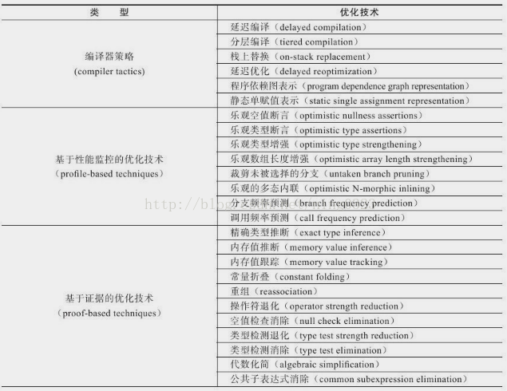
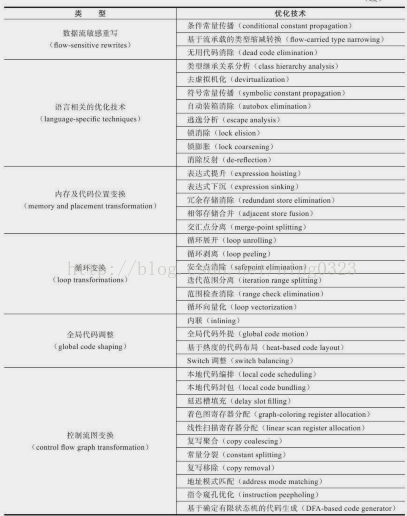

### 编译优化技术  

#### 语言无关的经典优化技术之一：公共子表达式消除  

普遍应用于各种编译器的经典优化技术  
若一个表达式E已经计算过，且从先前计算到现在E中所有变量值都未发生变化，则E的这次出现就成为了公共子表达式  
对于公共子表达式，无必要再花时间进行计算，只需使用前面计算过的表达式结果代替E即可  
若这种优化仅限于程序基本块内，则称局部公共子表达式消除（Local Common Subexpression Elimination）  
若这种优化范围涵盖多个基本块，则称全局公共子表达式消除（Global Common Subexpression Elimination）  

例：  
```
int d=(c*b)*12+a+(a+b*c);
公共子表达式消除优化后：
int d=E*12+a+(a+E);
代数化简优化（另外一种优化）后：
int d=E*13+a*2;
```  
#### 语言相关的经典优化技术之一：数组范围检查消除  

Java语言中，访问数组元素foo[i]时系统会自动进行上下界范围检查，即检查i必须满足i>=0＆＆i<foo.length，否则抛出运行时异常java.lang.ArrayIndexOutOfBoundsException  
如上，虚拟机执行子系统每次数组元素的读写都带有一次隐含条件判定操作，对于拥有大量数组访问的程序代码，这是一种性能负担
为了安全，数组边界检查是必须做的，但数组边界检查是不是必须在运行期间一次不漏地检查是可“商量”的  
如，  
数组访问发生在循环中，且使用循环变量进行数组访问  
若编译器只需通过数据流分析即可判定循环变量取值范围永远在区间[0，foo.length)内，则可在整个循环中把数组上下界检查消除  
这可节省很多次条件判断操作  
与语言相关的其他消除操作还有，  
自动装箱消除（Autobox Elimination）  
安全点消除（Safepoint Elimination）  
消除反射（Dereflection）等  

#### 最重要的优化技术之一：方法内联  
除消除方法调用成本外，更重要的意义是为其他优化手段建立良好基础  
看起来很简单，是把目标方法的代码“复制”到发起调用的方法中，避免发生真实的方法调用  

只有使用invokespecial指令调用的私有方法、实例构造器、父类方法及使用invokestatic指令调用的静态方法才是在编译期进行解析的  
除上述4种方法外，其他Java方法调用都需要在运行时进行方法接收者多态选择，且都可能存在多个版本的方法接收者  
Java语言中默认的实例方法是虚方法  

编译器在进行内联时  
若遇到非虚方法，则直接进行内联，这时的内联有稳定前提保障  
若遇到虚方法，则会向CHA（Class Hierarchy Analysis，类型继承关系分析）查询该方法在当前程序下是否有多个目标版本可供选择  
若查询到一个目标版本，可进行内联，但这种内联属激进优化，需预留一个“逃生门”，称守护内联（Guarded Inlining）  
在程序后续执行过程中  
若虚拟机未加载到会令该方法接收者的继承关系发生变化的类，则该内联优化代码可继续使用  
若加载了导致该方法接收者的继承关系发生变化的新类，则需抛弃已编译代码，退回到解释状态执行，或重新编译  
若查询到多个目标版本，则编译器会进行最后一次努力，使用内联缓存（Inline Cache）完成方法内联  

工作原理是：  
在未发生方法调用前，内联缓存状态为空  
当第一次调用发生后，缓存记录下方法接收者版本信息  
每次进行方法调用时都比较接收者版本  
若版本一致，则该内联继续可用  
若版本不一致，则说明程序真正使用了该虚方法的多态特性，这时会取消内联，查找虚方法表进行方法分派  

#### 最前沿的优化技术之一：逃逸分析  
目前较前沿的优化技术，仍不是十分成熟，但是是JIT编译器优化技术的一个重要发展方向  
不是直接优化代码的手段，而是为其他优化手段提供依据的分析技术  
基本行为是分析对象动态作用域：  
当一个对象在方法中被定义后，它可能被外部方法引用，如，作为调用参数传递到其他方法中，称方法逃逸  
甚至可能被外部线程访问，如，赋值给类变量或在其他线程中访问实例变量，称线程逃逸  

若能证明一个对象不会逃逸出方法或线程，则可为该变量进行一些高效优化，如，  

- 栈上分配（Stack Allocation）：  
Java堆中的对象对各线程共享、可见  
若逃逸分析能确定一个对象不会出现方法逃逸，则可让该对象在栈上分配内存，对象所占内存空间即可随栈帧出栈而销毁，垃圾收集系统的压力将会因此减小  
- 同步消除（Synchronization Elimination）：  
线程同步本身是一个相对耗时的过程
若逃逸分析能确定一个变量不会出现线程逃逸，则该对变量实施的同步措施即可消除
- 标量替换（Scalar Replacement）：  
标量（Scalar）指一个数据无法再分解成更小数据来表示，Java虚拟机中的原始数据类型可称为标量  
若一个数据可继续分解，则称聚合量（Aggregate），Java中的对象最典型的聚合量  
若把一个Java对象拆散，根据程序访问情况，将其使用到的成员变量恢复原始类型访问叫做标量替换  
若逃逸分析能确定一个对象不会被外部访问，且该对象可被拆散，则程序可不真正创建该对象，而是创建若干该对象使用的成员变量  
将对象拆散后，可让对象的成员变量在栈上分配和读写，及为进一步优化创建条件  

JDK1.6 Update 23 起默认开启逃逸分析，相关参数：  
-XX:+DoEscapeAnalysis 开启逃逸分析  
-XX:+PrintEscapeAnalysis 打印逃逸分析结果  
-XX:+EliminateAllocations 开启标量替换，需先开启逃逸分析  
-XX:+EliminateLocks 开启同步消除，需先开启逃逸分析  
-XX:+PrintEliminateAllocations 打印标量替换结果  

#### JIT编译优化技术列表  
  

