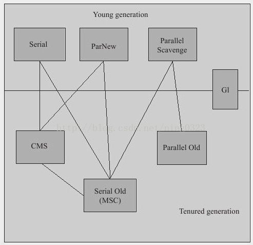
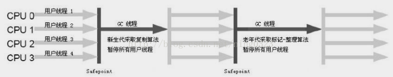
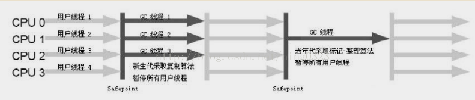
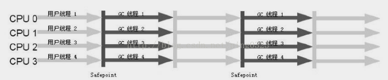
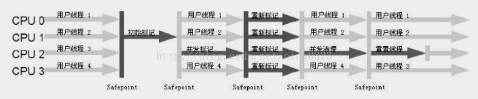
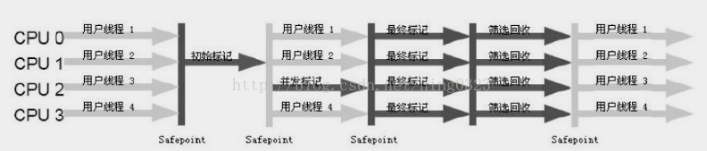
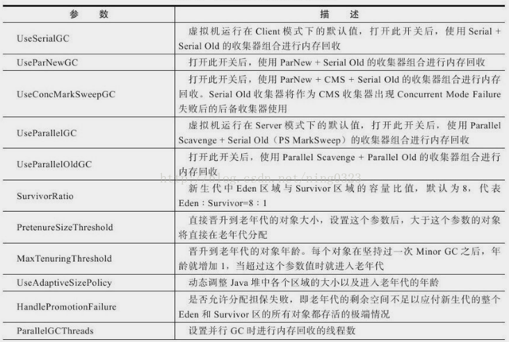
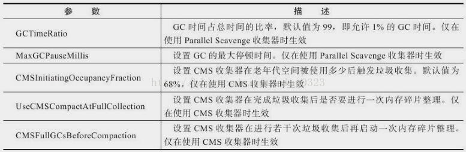

### 垃圾收集器  

下图展示7种作用于不同分代的收集器，所处区域表示属于新或老年代收集器，若两收集器间有连线，则说明它们可搭配使用，没有最好的收集器，只有对具体应用最合适的收集器。  
  

#### Serial收集器  
新生代“复制”算法  
单线程   
垃圾收集时会STW（Stop The world），随着HotSpot优化STW时间在缩短但不会消除  
简单高效，对单CPU环境无线程交互开销，可获得最高单线程收集效率，对Client模式虚拟机是很好的选择  
Serial + Serial Old运行示意图：  
  

#### ParNew收集器  
Serial多线程版本  
新生代“复制”算法  
多线程  
控制参数（如：-XXSurvivorRatio、-XXPretenureSizeThreshold、-XXHandlePromotionFailure等）、收集算法、STW、对象分配规则、回收策略等与Serial相同（两者共用很多代码）  
Server模式虚拟机首选收集器（原因之一是，除Serial外只有ParNew能与CMS搭配工作）  
默认开启线程数量=CPU个数，可用-XXParallelGCThreads参数限制线程数  
使用-XX+UseConcMarkSweepGC后默认的新生代收集器，可使用-XX+UseParNewGC强制指定  
单线程环境中ParNew不一定会比Serial有更好效果  
ParNew + Serial Old运行示意图：  
  

#### Parallel Scavenge收集器  
新生代“复制”算法  
多线程  
目标：达到可控吞吐量（Throughput），吞吐量=运行用户代码时间（运行用户代码时间+垃圾收集时间）  
短停顿时间适合与用户交互程序，高吞吐量可高效利用CPU时间、适合后台运算任务程序  
参数：  
```
-XXMaxGCPauseMillis，设置最大垃圾收集停顿时间，大于0的毫秒数，缩短停顿时间是以牺牲吞吐量和新生代空间实现的
-XXGCTimeRatio，设置吞吐量大小，大于0小于100的整数
-XX+UseAdaptiveSizePolicy，打开GC自适应调节策略，打开后，不需指定新生代大小（-Xmn）、Eden与Survivor比例（-XXSurvivorRatio）、晋升老年代对象年龄（-XXPretenureSizeThreshold）等细节参数
```  
Parallel Scavenge + Parallel Old运行示意图：  
  

#### Serial Old收集器  
Serial老年代版本  
老年代“标记-整理”算法  
单线程  
主要给Client模式虚拟机使用  

Server模式下2大用途：  

- 在JDK1.5及之前版本中与Parallel Scavenge搭配使用  
- 作为CMS后备预案，在并发收集发生Concurrent Mode Failure时使用  

Serial + Serial Old运行示意图：
  

#### Parallel Old收集器  
Parallel Scavenge老年代版本  
老年代“标记-整理”算法  
多线程  
JDK1.6开始提供，在此之前若新生代选择Parallel Scavenge老年代只有Serial Old可选  
Serial Old在服务端性能较差（单线程无法充分利用多CPU处理能力），与Parallel Scavenge搭配整体上不能获得最大化吞吐量，在老年代很大且硬件较高级环境，以上组合吞吐量可能不如ParNew+CMS组合“给力”  
在注重吞吐量、CPU资源敏感场合，可优先考虑Parallel Scavenge+Parallel Old组合  
Parallel Scavenge + Parallel Old运行示意图：  
  

#### CMS(Concurrent Mark Sweep)收集器  
老年代“标记-清除”算法  
多线程  
目标：获取最短停顿时间  
4个步骤：  

- 1) 初始标记（CMS initial mark），只标记GC Roots直接关联对象，会STW，时间很短
- 2) 并发标记（CMS concurrent mark），进行GC Roots Tracing
- 3) 重新标记（CMS remark），修正并发标记期间因用户程序继续运作而导致标记产生变动的那一部分对象的标记记录，会STW，时间比初始标记阶段稍长、但比并发标记时间短很多
- 4) 并发清除（CMS concurrent sweep）  

整个过程中耗时最长的并发标记、并发清除与用户线程一起工作，故整体上内存回收过程是与用户线程并发执行的  
默认线程数=(CPU数量+3)/4  
JDK1.6默认老年代使用率达到92%激活CMS（JDK1.5默认68%）  
参数：  
```
-XXCMSInitiatingOccupancyFraction，激活CMS百分比
-XX+UseCMSCompactAtFullCollection，进行FullGC时进行内存碎片整理，默认开启，非并发，若开启停顿时间会变长
-XXCMSFullGCsBeforeCompaction，设置执行多少次不压缩（内存碎片整理）FullGC后，来一次带压缩的FullGC，默认为0，每次FullGC都进行内存碎片整理
```  
优点：并发收集、低停顿  
缺点：  

- CPU资源敏感，并发阶段占用CPU导致应用程序变慢
- 无法处理浮动垃圾（Floating Garbage，重新标记阶段无法处理的垃圾），可能出现Concurrent Mode Failure导致另一次FullGC
- 会产生空间碎片，因为使用“标记-清除”算法  

CMS运行示意图：  
  

#### G1(Garbage-First)收集器  
面向服务端应用，JDK 7u4开始商用  
使命：未来替换掉CMS  
特点：  

- 1) 并行与并发：利用多CPU、多核硬件优势，缩短STW时间，部分其他收集器原本需停顿Java线程执行的GC动作，G1可通过并发方式实现不停顿执行
- 2) 分代收集：保留分代概念，可独立管理整个GC堆，能采用不同方式处理新创建对象、旧对象以获取更好收集效果
- 3) 空间整合：整体看是基于“标记-整理”算法实现，局部（Region之间）看是基于“复制”算法实现，两种算法都不会产生内存空间碎片。有利于程序长时间运行，分配大对象时不会因无法找到连续内存空间而提前触发下一次GC。
- 4) 可预测的停顿：相对于CMS另一大优势，降低停顿时间也是CMS关注点，但G1除追求低停顿外，能建立可预测停顿时间模型，可让使用者明确指定在长度为M毫秒时间段内，垃圾收集时间不超过N毫秒，这几乎已是实时Java（RTSJ）的垃圾收集器特征了

原理：  
将Java堆划分为多个大小相等独立区域（Region），新生代、老年代不再是物理隔离（其他收集器是），是一部分Region（不需要连续）的集合。以上称为“化整为零”思想  

跟踪各Region中垃圾堆积的价值大小（回收所获得空间大小、所需时间的经验值），在后台维护优先列表，根据用户允许收集时间，优先回收价值最大Region（Garbage-First名称由来），这种方式可保证有限时间内获取尽可能高的收集效率。以上是“可预测停顿”的具体原理或原因，即可有计划地避免整个Java堆进行全区域垃圾收集  

每个Region有一个对应Remembered Set，虚拟机发现程序对Reference类型数据进行写操作时，会产生WriteBarrier暂时中断写操作，检查Reference引用的对象是否处于不同Region（分代例子中是检查老年代中的对象是否引用了新生代中的对象），若是，则通过CardTable把相关引用信息记录到被引用对象所属Region的Remembered Set中，内存回收时，在GC根节点枚举范围中加入Remembered Set即可保证不对全堆扫描也不会有遗漏。以上是“Region间对象存在引用（其他收集器新生代、老年代间对象存在引用），虚拟机使用Remembered Set避免全堆扫描”的具体原理或原因。  

4个步骤（不计维护Remembered Set操作）：  

- 1) 初始标记（InitialMarking），只标记GC Roots直接关联对象，修改TAMS（Next Topat Mark Start）值，让下一阶段用户程序并发运行时能在正确、可用Region中创建新对象，会STW，耗时很短
- 2) 并发标记（ConcurrentMarking），进行可达性分析找出存活对象，耗时较长，可与用户程序并发执行
- 3) 最终标记（FinalMarking），修正在并发标记期间因用户程序继续运作而导致标记产生变动的那一部分标记记录，对象变化被记录在线程Remembered Set Logs、最终合并到Remembered Set，会STW，可多线程并行执行
- 4) 筛选回收（LiveDataCountingandEvacuation），首先对各Region回收价值、成本进行排序，然后根据用户期望停顿时间制定回收计划，可做到与用户程序并发执行，只回收部分Region故时间可控，若停顿用户线程可大幅提高收集效率  

最大优点：停顿时间可控、可预测  
G1运行示意图：  
  

参数总结：  
  

