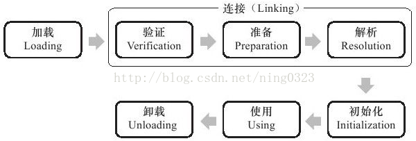

### 类加载时机  

**类的生命周期：**  
  

加载、验证、准备、初始化和卸载5个阶段必须按顺序开始，不一定按顺序进行、结束，这些阶段通常是交叉进行的（在一个阶段执行过程中调用、激活另外一个阶段）  

解析阶段在某些情况下可在初始化阶段后开始，目的是为了支持Java语言的运行时绑定（也称动态绑定、晚期绑定）  

1.加载   
我们编写一个java的源文件，经过编译后生成一个后缀名为.class的文件，这结合四字节码文件，
java虚拟机就识别这种文件，java的生命周期就是class文件从加载到消亡的过程。 
关于加载，其实，就是将源文件的class文件找到类的信息将其加载到方法区中，
然后在堆区中实例化一个java.lang.Class对象，作为方法区中这个类的信息的入口。
但是这一功能是在JVM之外实现的，主要的原因是方便让应用程序自己决定如何获取这个类，
在不同的虚拟机实现的方式不一定相同，hotspot虚拟机是采用需要时在加载的方式，
也有其他是先预先加载的。   

2.连接   
一般会跟加载阶段和初始化阶段交叉进行，过程由三部分组成：验证、准备和解析三步   
（1）验证：确定该类是否符合java语言的规范，有没有属性和行为的重复，继承是否合理，总之，就是保证jvm能够执行   
（2）准备：主要做的就是为由static修饰的成员变量分配内存，并设置默认的初始值   
默认初始值如下：

1.八种基本数据类型默认的初始值是0   
2.引用类型默认的初始值是null   
3.有static final修饰的会直接赋值，例如：static final int x=10；则默认就是10.  
（3）解析：这一阶段的任务就是把常量池中的符号引用转换为直接引用，说白了就是jvm会将所有的类或接口名、字段名、方法名转换为具体的内存地址。   

3.初始化   
这个阶段就是将静态变量（类变量）赋值的过程，即只有static修饰的才能被初始化，执行的顺序就是：  

父类静态域或着静态代码块，然后是子类静态域或者子类静态代码块  

4.使用   
在类的使用过程中依然存在三步：对象实例化、垃圾收集、对象终结  

（1）对象实例化：就是执行类中构造函数的内容，如果该类存在父类JVM会通过显示或者隐示的方式先执行父类的构造函数，在堆内存中为父类的实例变量开辟空间，并赋予默认的初始值，然后在根据构造函数的代码内容将真正的值赋予实例变量本身，然后，引用变量获取对象的首地址，通过操作对象来调用实例变量和方法   
（2）垃圾收集：当对象不再被引用的时候，就会被虚拟机标上特别的垃圾记号，在堆中等待GC回收   
（3）对象的终结：对象被GC回收后，对象就不再存在，对象的生命也就走到了尽头  

5.类卸载 
即类的生命周期走到了最后一步，程序中不再有该类的引用，该类也就会被JVM执行垃圾回收，从此生命结束…  

**有且只有5种情况必须立即对类进行“初始化”：**  

1. 遇到new、getstatic、putstatic或invokestatic这4条字节码指令时，若类未初始化过，则先触发其初始化  
4条指令最常见的Java代码场景是：  
使用new关键字实例化对象  
读取或设置类静态字段（被final修饰、在编译期把结果放入常量池的静态字段除外）  
调用类静态方法  
2. 使用java.lang.reflect包的方法对类进行反射调用时，若类未初始化过，则先触发其初始化  
3. 初始化类时，若其父类未初始化过，则先触发其父类初始化  
4. 虚拟机启动时，用户需指定一个要执行的主类（包含main()方法的类），虚拟机会先初始化该主类  
5. 使用JDK1.7动态语言支持时，若java.lang.invoke.MethodHandle的实例最后解析结果是REF_getStatic、REF_putStatic、
REF_invokeStatic的方法句柄，且该方法句柄对应的类未初始化过，则需先初始化这个类  

以上5种行为称为对类进行主动引用，除此之外称为被动引用，被动引用不会触发类初始化  

3种被动引用类：  

1. 子类引用父类的静态字段，子类不会触发初始化，对于静态字段，只有直接定义该字段的类才会被初始化，对于子类的加载和验证，虚拟机规范未规定  
2. 通过数组定义引用类，该类不会触发初始化，但会初始化一个虚拟机自动生成、直接继承java.lang.Object的子类“[L类全限定名”  
3. 常量在编译阶段存入当前类的常量池中，本质上未直接引用定义常量的类，故不会触发定义常量的类初始化  

**接口加载与类加载稍有不同：**  

1. 接口也有初始化过程（与类一致），编译器会为接口生成"<clinit>()"类构造器，用于初始化接口中定义的成员变量  
2. 接口与类真正的区别：类初始化时要求其父类全部都已初始化，接口初始化时不要求其父接口全部都已初始化，在真正使用父接口时（如引用接口中定义的常量）父接口才会初始化  