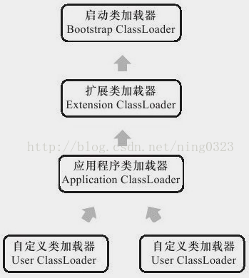

### 类加载器  
每个类加载器，都拥有一个独立的类名称空间  
对于任意类，需要由加载它的类加载器和该类本身一同确立其在Java虚拟机中的唯一性  
比较两个类是否“相等”，只有在两个类是由同一个类加载器加载的前提下才有意义  

在Java虚拟机角度只存在两种类加载器：  

1. 启动类加载器（Bootstrap ClassLoader），由C++语言实现，是虚拟机自身的一部分  
2. 所有其他的类加载器，由Java语言实现，独立于虚拟机外部，且全都继承自抽象类java.lang.ClassLoader  

3种系统提供的类加载器：  

1. 启动类加载器（Bootstrap ClassLoader）  
负责加载＜JAVA_HOME＞\lib目录、或-Xbootclasspath参数指定路径肿的，且虚拟机能识别（仅按文件名识别，如rt.jar）的类库  
启动类加载器无法被Java程序直接引用，编写自定义类加载器时，若需把加载请求委派给该类加载器，可直接使用null代替  
2. 扩展类加载器（Extension ClassLoader）  
负责加载＜JAVA_HOME＞\lib\ext目录，或java.ext.dirs系统变量指定路径中的类库  
由sun.misc.Launcher $ExtClassLoader实现  
开发者可以直接使用该类加载器  
3. 应用程序类加载器（Application ClassLoader）  
负责加载用户类路径（ClassPath）指定的类库  
由sun.misc.Launcher$App-ClassLoader实现  
是ClassLoader中的getSystemClassLoader()方法的返回值，故也称系统类加载器  
开发者可直接使用该类加载器  
若应用程序中未自定义自己的类加载器，一般该类加载器就是程序默认类加载器  

类加载器的双亲委派模型（Parents Delegation Model）：  
  

模型工作过程：  
任意层次类加载器收到类加载请求时，首先把该请求委派给父级类加载器完成（由此所有加载请求最终都应传到顶层启动类加载器），当父级类加载器反馈无法完成加载请求时，子加载器才尝试自己去加载  
模型要求除顶层启动类加载器外，其余类加载器都应有自己的父级类加载器  
类加载器间父子关系一般使用组合（Composition）关系复用父级类加载器代码  

模型好处：  
Java类随着它的类加载器一起具备了带有优先级的层次关系，可保证Java程序稳定运作  

模型实现：  
逻辑代码集中在java.lang.ClassLoader的loadClass()方法{  
检查类是否被加载过  
若没有，则调父级类加载器的loadClass()方法  
若父级类加载器为空，则默认使用启动类加载器作为父级类加载器  
若父级类加载器加载失败，则抛ClassNotFoundException异常，然后调自己的findClass()方法进行加载  
}  

Java中涉及SPI的加载动作（即父加载器请求子加载器完成类加载动作）采用线程上下文类加载器（Thread Context ClassLoader）加载，例JNDI、JDBC  
