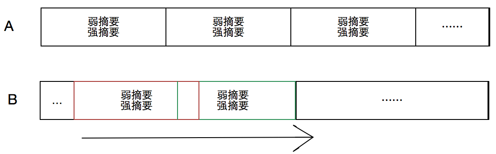
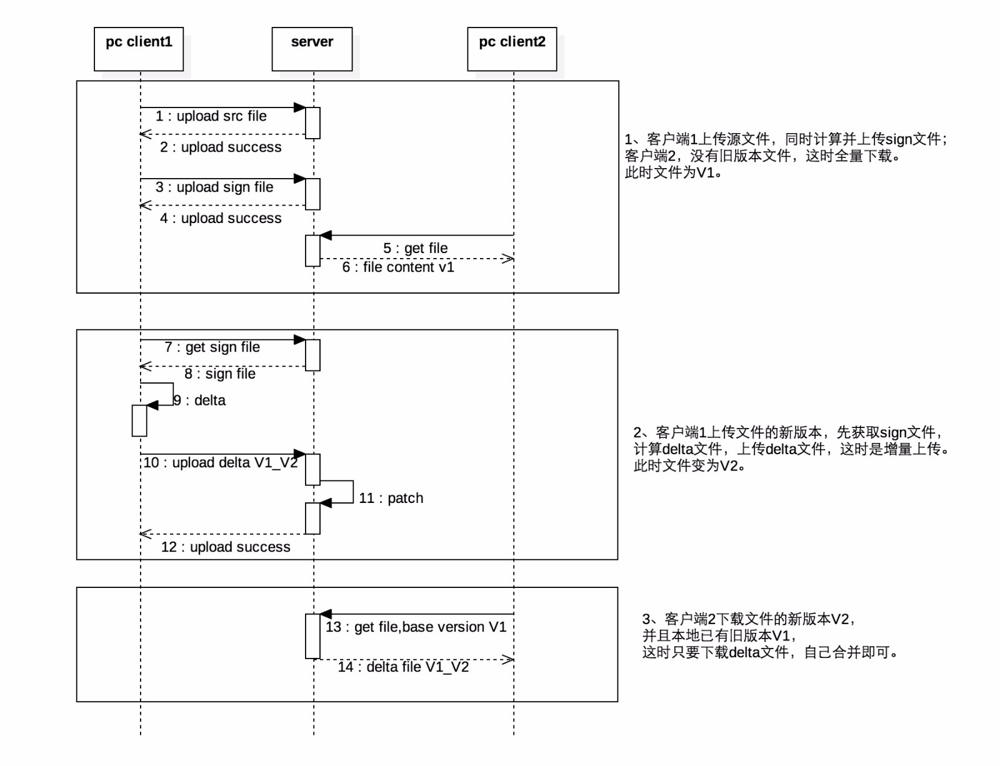
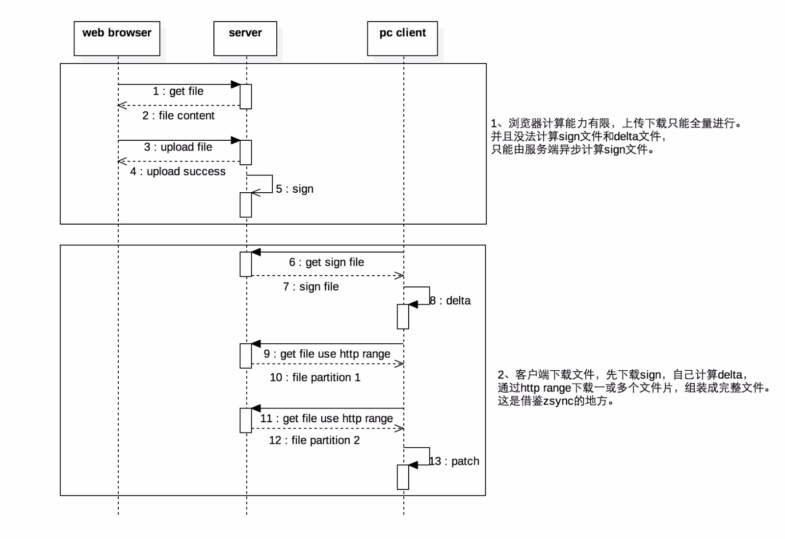

### 基于rsync的文件增量同步方案  
rsync增量传输算法首度发表于1996年6月19日，原始作者为Andrew Tridgell与Paul Mackerras [1]。实现增量传输的主要过程，就是差异检测和差异数据组织及传输，前者是rsync增量传输算法的核心。

rsync增量传输算法是一种滑动块差异检测算法。以检测文件A和B的差异为例，首先对A按固定长度L划分为若干块，并对每一块生成弱摘要（Adler-32：速度快）和强摘要（MD5：鉴别度高），然后对B从第一个字节开始，以长度为L的滑动窗口，遍历整个文件，计算每个窗口块的弱、强摘要，并与A中的摘要值进行比较，弱、强摘要都相同者，即视为相同数据块，否即为差异块。如下图所示：  
  
rsync增量传输算法主要有两个特点： 
 
- 固定块摘要和滑动块检测的结合，提高命中率；  
- 弱摘要和强摘要的结合，加快比对速度。  

#### rsync工具的工作机制  
rsync增量传输算法使用最多的场景就是类UNIX系统上的rsync同步工具。该工具非常流行，被应用于大量的文件传输场景。比如现在美团点评发布系统就用rsync同步发布机器上编译后文件到生产机器上的。  

rsync工具的工作机制，如下阐述。  

目标：主机A、B，A要同步文件F-new给B，B上已有文件F-old，跟F-new相似度高。  

步骤：  

- B对文件F-old分块计算强弱摘要，链接起来生成sign文件，此过程简称sign，把sign文件发送给A；  
- A根据sign文件和本地文件F-new比较，滑动块进行差异检测，把相同块的序号和不同块的内容拼装为delta文件，此过程也简称delta，发送给B；  
- B拿到delta文件，并与本地源文件F-old结合，生成F-new文件，此过程简称patch。  

如果目标是B要同步文件给A，那就是步骤中把A、B换一下位置。  
小结：同步的双方A、B基本是对等的，一方计算sign和合并文件，一方计算delta。 双方都有较大计算量，这在一个服务器多客户端场景下，服务端压力会过大。  

#### zsync工具的工作机制  
zsync是Ubuntu上使用比较多的工具，主要用于分发Ubuntu的安装镜像ISO文件。zsync是rsync的一种变体，对rsync增量传输算法有所改造，并且基于HTTP协议，适合广域网应用。  

zsync适用的场景是：大文件、变动少、一个分发点（服务端）、大量下载（客户端）。  

使用步骤为：  

- 发布方制作好新版系统安装ISO镜像（大文件），同时生成对应的sign文件，两者都提供HTTP下载地址；  
- 客户端如果没有旧版本镜像，那么全量下载ISO文件；  
- 客户端如果有旧版本镜像，那么下载sign文件，自己计算delta文件，同时自己合并出新版本镜像。合并过程是，发现相同块就从本地旧版本读取，不同的块，则使用HTTP Range的方式从服务端下载。  

zsync算法，使发布方（服务端）只要一次签名文件的计算即可支撑大量客户端增量下载，缓解服务端压力。需要增加的签名文件存储空间，也是成本很低的。  

#### 云盘的文件增量同步方案  
基于上面介绍的rsync工具的传输步骤，并借鉴zsync增量下载的思路，制定云盘文件增量同步方案，如下图所示：  
  
  

主要的方案设计要点是：  

- 计算sign和计算delta都在PC客户端进行，服务器端只做必不可少的合并处理，同时客户端根据结算结果，如果发现命中率低，也可以选择全量传输；
- 增量下载时，借鉴zsync，也把计算量放在PC客户端进行，这个实现也需要参考zsync对rsync原算法进行一定改造；
- 浏览器处理能力有限，无法实现增量同步；
- 服务端需要存（一定量的）sign文件、delta文件；
- 服务端还要合并出新文件并存储，主要是基于这些考虑：  
① 防止delta管理的复杂；  
② 有完整文件，下载简单，浏览器下载可以直接通过mss（美团云对象存储服务，犀牛云盘的文件数据的存储工具） tempurl下载；  
③ 增量同步出问题还可以降级服务，保证基本功能正常。  

#### 方案还存在的问题  
1. 碎片块，这是rsync增量传输算法特点造成的，由于是滑动窗口检测，在两个相同块之间，有可能存在一个长度不定的差异块。如果相同块不连续，就会形成一系列碎片块。减少滑动块长度（也即是sign计算的固定块长度），可以提高命中率、减少碎片块，但计算量也随着加大，sign文件也变大，可能得不偿失。所以只能根据试验情况，取一个折衷的块长度。目前我们采取默认2KB的块长度，对每块生成4B弱摘要，16B强摘要，那么sign文件与源文件的长度比=20/2K=1/100（这里忽略sign文件头固定8B的小量影响）。  

2. 对JPEG、视频等类型的文件，局部改变可能性小，且文件一般比较大，差异检测计算量大但命中率低，不进行增量同步尝试。  

3. 基于以上设计方案，服务器端要做合并patch操作，但合并操作的时间和资源消耗还是挺大的，需要做：

	- 接收并缓存delta文件；
	- 从底层存储（mss）下载旧文件；
	- 合并文件；
	- 向底层存储上传新文件。
	
该问题可从以下两方面做优化尝试：  

	- 改进点1：合并文件流式处理，但网络的流对流处理容易不稳定。而旧文件还得全部下载，因为有随机读；
	- 改进点2：把合并过程作为异步处理，接收delta文件后，就返回给客户端“成功”，服务端慢慢合并，但如果失败了，很难有手段再重新从客户端取到正确文件，需要借助消息推送辅助。  

#### 算法的后续优化项  
第一，rsync工具及类库中为了做到极致的最小传输量，sign文件头没有保存源文件长度，delta文件块长度用不同数量的Byte来表示。建议修改。前者保存文件长度，方便做类似zsync的改造（zsync算法起作用需要整个文件长度）和下载时的长度校验；后者用固定数量Byte表示长度（每个长度值都要使用多个Byte），虽然多消耗一些传输量，但编码简单，处理效率高。  

第二，对某些文件格式已知的文件，可以根据格式特点，做变长分块。比如MS Office的Open XML格式，其实是Zip组织方式，可以按Zip协议的分界标识来分块，提高命中率，但这需要对rsync增量传输算法进行修改。  

第三，结合CDC（content-defined chunking）做变长分块检测，这方面属于研究的方向，但目前还没有比较通用可靠的解决方案。下面根据找到的资料做一下描述：  

CDC算法是一种变长分块算法，它应用数据指纹（如Rabin指纹[5]）将文件分割成长度大小不等的分块策略。与定长分块算法不同，它是基于文件内容进行数据块切分的，因此数据块大小是可变化的。算法执行过程中，CDC使用一个固定大小（如48字节）的滑动窗口对文件数据计算数据指纹。如果指纹满足某个条件，如当它的值模特定的整数等于预先设定的数时，则把窗口位置作为块的边界。  

CDC算法可能会出现病态现象，即指纹条件不能满足、块边界不能确定，导致数据块过大。实现中可以对数据块的大小进行限定，通过设定上下限来解决这种问题。CDC算法对文件内容变化不敏感，插入或删除数据只会影响到较少的数据块，其余数据块不受影响。CDC算法也有缺陷，数据块大小的确定比较困难，粒度太细则开销太大，粒度过粗则检测效果不佳。如何两者之间权衡折衷，这是一个难点。  

相比CDC，rsync是滑动块算法。滑动块算法对插入和删除问题处理非常高效，并且能够检测到比CDC更多的冗余数据，它的不足是容易产生数据碎片。如果能结合两者的优点，那就能更高效做差异检测，比如上面提到的Open XML格式按Zip标记分界的思路，其实是CDC思路的一个特例。  
