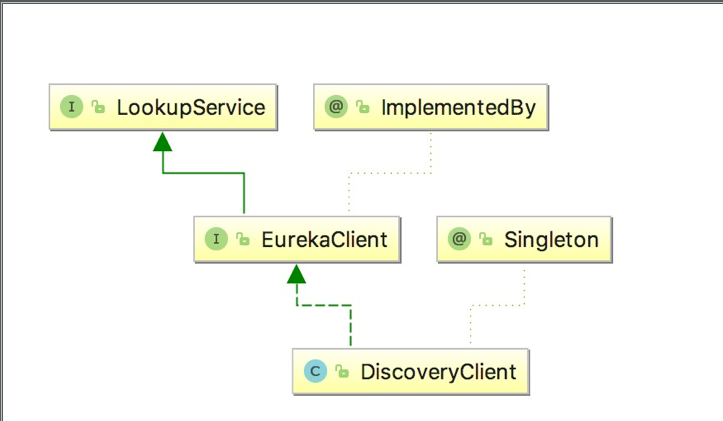

### 深入理解Eureka
#### Eureka源码地址
https://github.com/Netflix/eureka
#### Eureka服务
- Register：服务注册
  当Eureka客户端向Eureka Server注册时，它提供自身的元数据，比如IP地址、端口，运行状况指示符URL，主页等。

- Renew：服务续约
  Eureka客户会每隔30秒发送一次心跳来续约。 通过续约来告知Eureka Server该Eureka客户仍然存在，没有出现问题。 正常情况下，如果Eureka Server在90秒没有收到Eureka客户的续约，它会将实例从其注册表中删除。 建议不要更改续约间隔。

- Fetch Registries：获取注册列表信息
  Eureka客户端从服务器获取注册表信息，并将其缓存在本地。客户端会使用该信息查找其他服务，从而进行远程调用。该注册列表信息定期（每30秒钟）更新一次。每次返回注册列表信息可能与Eureka客户端的缓存信息不同， Eureka客户端自动处理。如果由于某种原因导致注册列表信息不能及时匹配，Eureka客户端则会重新获取整个注册表信息。 Eureka服务器缓存注册列表信息，整个注册表以及每个应用程序的信息进行了压缩，压缩内容和没有压缩的内容完全相同。Eureka客户端和Eureka 服务器可以使用JSON / XML格式进行通讯。在默认的情况下Eureka客户端使用压缩JSON格式来获取注册列表的信息。

- Cancel：服务下线
  Eureka客户端在程序关闭时向Eureka服务器发送取消请求。 发送请求后，该客户端实例信息将从服务器的实例注册表中删除。该下线请求不会自动完成，它需要调用以下内容：
  DiscoveryManager.getInstance().shutdownComponent()；

- Eviction 服务剔除
  在默认的情况下，当Eureka客户端连续90秒没有向Eureka服务器发送服务续约，即心跳，Eureka服务器会将该服务实例从服务注册列表删除，即服务剔除。

#### Eureka的高可用架构


#### Register服务注册
服务注册，即Eureka Client向Eureka Server提交自己的服务信息，包括IP地址、端口、service ID等信息。如果Eureka Client没有写service ID，则默认为 ${spring.application.name}。

服务注册其实很简单，在Eureka Client启动的时候，将自身的服务的信息发送到Eureka Server。现在来简单的阅读下源码。在Maven的依赖包下，找到eureka-client-1.6.2.jar包。在com.netflix.discovery包下有个DiscoveryClient类，该类包含了Eureka Client向Eureka Server的相关方法。其中DiscoveryClient实现了EurekaClient接口，并且它是一个单例模式，而EurekaClient继承了LookupService接口。它们之间的关系如图所示。



在DiscoveryClient类有一个服务注册的方法register()，该方法是通过Http请求向Eureka Client注册。其代码如下：
```
    /**
     * Register with the eureka service by making the appropriate REST call.
     */
    boolean register() throws Throwable {
        logger.info(PREFIX + "{}: registering service...", appPathIdentifier);
        EurekaHttpResponse<Void> httpResponse;
        try {
            httpResponse = eurekaTransport.registrationClient.register(instanceInfo);
        } catch (Exception e) {
            logger.warn(PREFIX + "{} - registration failed {}", appPathIdentifier, e.getMessage(), e);
            throw e;
        }
        if (logger.isInfoEnabled()) {
            logger.info(PREFIX + "{} - registration status: {}", appPathIdentifier, httpResponse.getStatusCode());
        }
        return httpResponse.getStatusCode() == 204;
    }
```
在DiscoveryClient类继续追踪register()方法，它被InstanceInfoReplicator 类的run()方法调用，其中InstanceInfoReplicator实现了Runnable接口，run()方法代码如下：
```
    public void run() {
        try {
            discoveryClient.refreshInstanceInfo();

            Long dirtyTimestamp = instanceInfo.isDirtyWithTime();
            if (dirtyTimestamp != null) {
                discoveryClient.register();
                instanceInfo.unsetIsDirty(dirtyTimestamp);
            }
        } catch (Throwable t) {
            logger.warn("There was a problem with the instance info replicator", t);
        } finally {
            Future next = scheduler.schedule(this, replicationIntervalSeconds, TimeUnit.SECONDS);
            scheduledPeriodicRef.set(next);
        }
    }
```
而InstanceInfoReplicator类是在DiscoveryClient初始化过程中使用的，其中有一个initScheduledTasks()方法。该方法主要开启了获取服务注册列表的信息，如果需要向Eureka Server注册，则开启注册，同时开启了定时向Eureka Server服务续约的定时任务，具体代码如下：
```
/**
     * Initializes all scheduled tasks.
     */
    private void initScheduledTasks() {
        if (clientConfig.shouldFetchRegistry()) {
            // registry cache refresh timer
            int registryFetchIntervalSeconds = clientConfig.getRegistryFetchIntervalSeconds();
            int expBackOffBound = clientConfig.getCacheRefreshExecutorExponentialBackOffBound();
            scheduler.schedule(
                    new TimedSupervisorTask(
                            "cacheRefresh",
                            scheduler,
                            cacheRefreshExecutor,
                            registryFetchIntervalSeconds,
                            TimeUnit.SECONDS,
                            expBackOffBound,
                            new CacheRefreshThread()
                    ),
                    registryFetchIntervalSeconds, TimeUnit.SECONDS);
        }

        if (clientConfig.shouldRegisterWithEureka()) {
            int renewalIntervalInSecs = instanceInfo.getLeaseInfo().getRenewalIntervalInSecs();
            int expBackOffBound = clientConfig.getHeartbeatExecutorExponentialBackOffBound();
            logger.info("Starting heartbeat executor: " + "renew interval is: {}", renewalIntervalInSecs);

            // Heartbeat timer
            scheduler.schedule(
                    new TimedSupervisorTask(
                            "heartbeat",
                            scheduler,
                            heartbeatExecutor,
                            renewalIntervalInSecs,
                            TimeUnit.SECONDS,
                            expBackOffBound,
                            new HeartbeatThread()
                    ),
                    renewalIntervalInSecs, TimeUnit.SECONDS);

            // InstanceInfo replicator
            instanceInfoReplicator = new InstanceInfoReplicator(
                    this,
                    instanceInfo,
                    clientConfig.getInstanceInfoReplicationIntervalSeconds(),
                    2); // burstSize

            statusChangeListener = new ApplicationInfoManager.StatusChangeListener() {
                @Override
                public String getId() {
                    return "statusChangeListener";
                }

                @Override
                public void notify(StatusChangeEvent statusChangeEvent) {
                    if (InstanceStatus.DOWN == statusChangeEvent.getStatus() ||
                            InstanceStatus.DOWN == statusChangeEvent.getPreviousStatus()) {
                        // log at warn level if DOWN was involved
                        logger.warn("Saw local status change event {}", statusChangeEvent);
                    } else {
                        logger.info("Saw local status change event {}", statusChangeEvent);
                    }
                    instanceInfoReplicator.onDemandUpdate();
                }
            };

            if (clientConfig.shouldOnDemandUpdateStatusChange()) {
                applicationInfoManager.registerStatusChangeListener(statusChangeListener);
            }

            instanceInfoReplicator.start(clientConfig.getInitialInstanceInfoReplicationIntervalSeconds());
        } else {
            logger.info("Not registering with Eureka server per configuration");
        }
    }
```
然后在来看Eureka server端的代码，在eureka-core模块下。打开com.netflix.eureka包，很轻松的就发现了又一个EurekaBootStrap的类，BootStrapContext具有最先初始化的权限，所以先看这个类。
```
protected void initEurekaServerContext() throws Exception {

 ...//省略代码
   PeerAwareInstanceRegistry registry;
        if (isAws(applicationInfoManager.getInfo())) {
           ...//省略代码，如果是AWS的代码
        } else {
            registry = new PeerAwareInstanceRegistryImpl(
                    eurekaServerConfig,
                    eurekaClient.getEurekaClientConfig(),
                    serverCodecs,
                    eurekaClient
            );
        }

        PeerEurekaNodes peerEurekaNodes = getPeerEurekaNodes(
                registry,
                eurekaServerConfig,
                eurekaClient.getEurekaClientConfig(),
                serverCodecs,
                applicationInfoManager
        );
 }
```
其中PeerAwareInstanceRegistryImpl和PeerEurekaNodes两个类看其命名，应该和服务注册以及Eureka Server高可用有关。先追踪PeerAwareInstanceRegistryImpl类，在该类有个register()方法，该方法提供了注册，并且将注册后信息同步到其他的Eureka Server服务。代码如下：
```
public void register(final InstanceInfo info, final boolean isReplication) {
        int leaseDuration = Lease.DEFAULT_DURATION_IN_SECS;
        if (info.getLeaseInfo() != null && info.getLeaseInfo().getDurationInSecs() > 0) {
            leaseDuration = info.getLeaseInfo().getDurationInSecs();
        }
        super.register(info, leaseDuration, isReplication);
        replicateToPeers(Action.Register, info.getAppName(), info.getId(), info, null, isReplication);
    }
```
其中 super.register(info, leaseDuration, isReplication)方法，点击进去到子类AbstractInstanceRegistry可以发现更多细节，其中注册列表的信息被保存在一个Map中。replicateToPeers()方法，即同步到其他Eureka Server的其他Peers节点，追踪代码，发现它会遍历循环向所有的Peers节点注册，最终执行类PeerEurekaNodes的register()方法，该方法通过执行一个任务向其他节点同步该注册信息，代码如下:
```
public void register(final InstanceInfo info) throws Exception {
        long expiryTime = System.currentTimeMillis() + getLeaseRenewalOf(info);
        batchingDispatcher.process(
                taskId("register", info),
                new InstanceReplicationTask(targetHost, Action.Register, info, null, true) {
                    public EurekaHttpResponse<Void> execute() {
                        return replicationClient.register(info);
                    }
                },
                expiryTime
        );
    }
```
经过一系列的源码追踪，可以发现PeerAwareInstanceRegistryImpl的register()方法实现了服务的注册，并且向其他Eureka Server的Peer节点同步了该注册信息，那么register()方法被谁调用了呢？之前在Eureka Client的分析可以知道，Eureka Client是通过 http来向Eureka Server注册的，那么Eureka Server肯定会提供一个注册的接口给Eureka Client调用，那么PeerAwareInstanceRegistryImpl的register()方法肯定最终会被暴露的Http接口所调用。在Idea开发工具，按住alt+鼠标左键，可以很快定位到ApplicationResource类的addInstance ()方法，即服务注册的接口，其代码如下：

```
@POST
    @Consumes({"application/json", "application/xml"})
    public Response addInstance(InstanceInfo info,
                                @HeaderParam(PeerEurekaNode.HEADER_REPLICATION) String isReplication) {

    ...//省略代码
               registry.register(info, "true".equals(isReplication));
        return Response.status(204).build();  // 204 to be backwards compatible
    }
```
### Renew服务续约
服务续约和服务注册非常类似，通过之前的分析可以知道，服务注册在Eureka Client程序启动之后开启，并同时开启服务续约的定时任务。在eureka-client模块的DiscoveryClient的类下有renew()方法，其代码如下：
```
/**
     * Renew with the eureka service by making the appropriate REST call
     */
    boolean renew() {
        EurekaHttpResponse<InstanceInfo> httpResponse;
        try {
            httpResponse = eurekaTransport.registrationClient.sendHeartBeat(instanceInfo.getAppName(), instanceInfo.getId(), instanceInfo, null);
            logger.debug("{} - Heartbeat status: {}", PREFIX + appPathIdentifier, httpResponse.getStatusCode());
            if (httpResponse.getStatusCode() == 404) {
                REREGISTER_COUNTER.increment();
                logger.info("{} - Re-registering apps/{}", PREFIX + appPathIdentifier, instanceInfo.getAppName());
                return register();
            }
            return httpResponse.getStatusCode() == 200;
        } catch (Throwable e) {
            logger.error("{} - was unable to send heartbeat!", PREFIX + appPathIdentifier, e);
            return false;
        }
    }
```
另外服务端的续约接口在eureka-core模块的 com.netflix.eureka包下的InstanceResource类下，接口方法为renewLease()，它是REST接口。为了减少类篇幅，省略了大部分代码的展示。其中有个registry.renew()方法，即服务续约，代码如下:
```
@PUT
public Response renewLease(...参数省略）{
     ...  代码省略
    boolean isSuccess=registry.renew(app.getName(),id, isFromReplicaNode);
       ...  代码省略
 }
```
### Eureka服务发现时间
- Eureka Client一启动（不是启动完成），不是立即向Eureka Server注册，它有一个延迟向服务端注册的时间，通过跟踪源码，可以发现默认的延迟时间为40秒，源码在eureka-client模块的DefaultEurekaClientConfig类下，代码如下：
```
public int getInitialInstanceInfoReplicationIntervalSeconds() {
    return configInstance.getIntProperty(
        namespace + INITIAL_REGISTRATION_REPLICATION_DELAY_KEY, 40).get();
 }
```
- Eureka Server的响应缓存
Eureka Server维护每30秒更新的响应缓存,可通过更改配置eureka.server.responseCacheUpdateIntervalMs来修改。 所以即使实例刚刚注册，它也不会出现在调用/ eureka / apps REST端点的结果中。

- Eureka Server刷新缓存
Eureka客户端保留注册表信息的缓存。 该缓存每30秒更新一次（如前所述）。 因 此，客户端决定刷新其本地缓存并发现其他新注册的实例可能需要30秒。

- LoadBalancer Refresh
Ribbon的负载平衡器从本地的Eureka Client获取服务注册列表信息。Ribbon本身还维护本地缓存，以避免为每个请求调用本地客户端。 此缓存每30秒刷新一次（可由ribbon.ServerListRefreshInterval配置）。 所以，可能需要30多秒才能使用新注册的实例。
综上几个因素，一个新注册的实例，特别是启动较快的实例（默认延迟40秒注册），不能马上被Eureka Server发现。另外，刚注册的Eureka Client也不能立即被其他服务调用，因为调用方因为各种缓存没有及时的获取到新的注册列表。

### Eureka 的自我保护模式
当一个新的Eureka Server出现时，它尝试从相邻节点获取所有实例注册表信息。如果从Peer节点获取信息时出现问题，Eureka Serve会尝试其他的Peer节点。如果服务器能够成功获取所有实例，则根据该信息设置应该接收的更新阈值。如果有任何时间，Eureka Serve接收到的续约低于为该值配置的百分比（默认为15分钟内低于85％），则服务器开启自我保护模式，即不再剔除注册列表的信息。

这样做的好处就是，如果是Eureka Server自身的网络问题，导致Eureka Client的续约不上，Eureka Client的注册列表信息不再被删除，也就是Eureka Client还可以被其他服务消费。

自我保护机制的工作机制是如果在15分钟内超过85%的客户端节点都没有正常的心跳，那么Eureka就认为客户端与注册中心出现了网络故障，Eureka Server自动进入自我保护机制，此时会出现以下几种情况：

- Eureka Server不再从注册列表中移除因为长时间没收到心跳而应该过期的服务。

- Eureka Server仍然能够接受新服务的注册和查询请求，但是不会被同步到其它节点上，保证当前节点依然可用。

- 当网络稳定时，当前Eureka Server新的注册信息会被同步到其它节点中。