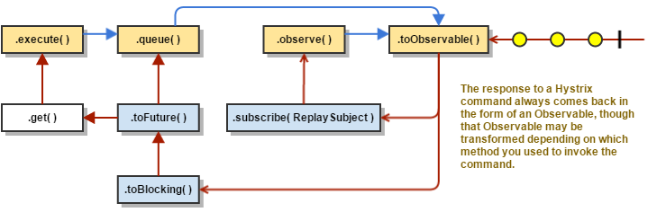

### 深入理解Hystrix

Netflix创建了一个名为Hystrix的库,实现了断路器的模式。“断路器”本身是一种开关装置，当某个服务单元发生故障之后，通过断路器的故障监控（类似熔断保险丝），向调用方返回一个符合预期的、可处理的备选响应（FallBack），而不是长时间的等待或者抛出调用方无法处理的异常，这样就保证了服务调用方的线程不会被长时间、不必要地占用，从而避免了故障在分布式系统中的蔓延，乃至雪崩。

#### Hystrix的设计原则
- 防止单个服务的故障，耗尽整个系统服务的容器（比如tomcat）的线程资源。
- 减少负载并快速失败，而不是排队。
- 在可行的情况下提供回退以保护用户免受故障。
- 使用隔离技术（如隔板，泳道和断路器模式）来限制任何一个依赖的影响。
- 通过近乎实时的指标，监控和警报来优化发现故障的时间。
- 通过配置更改的低延迟传播优化恢复时间，并支持Hystrix大多数方面的动态属性更改，从而允许您使用低延迟反馈循环进行实时操作修改。
- 保护整个依赖客户端执行中的故障，而不仅仅是在网络流量上进行保护降级、限流。

#### Hystrix工作原理
下图显示通过Hystrix向服务依赖关系发出请求时会发生什么：


具体将从以下几个方面进行描述：  

1. 构建一个HystrixCommand或者HystrixObservableCommand 对象。  
第一步是构建一个HystrixCommand或HystrixObservableCommand对象来表示你对依赖关系的请求。 其中构造函数需要和请求时的参数一致。
构造HystrixCommand对象，如果依赖关系预期返回单个响应。 可以这样写：
```
HystrixCommand command = new HystrixCommand(arg1, arg2); 
```  
同理，可以构建HystrixObservableCommand：  
``` 
HystrixObservableCommand command = new HystrixObservableCommand(arg1, arg2);
```

2. 执行Command  
通过使用Hystrix命令对象的以下四种方法之一，可以执行该命令有四种方法（前两种方法仅适用于简单的HystrixCommand对象，并不适用于HystrixObservableCommand）：

    - execute()–阻塞，，然后返回从依赖关系接收到的单个响应（或者在发生错误时抛出异常）
    - queue()–返回一个可以从依赖关系获得单个响应的future 对象
    - observe()–订阅Observable代表依赖关系的响应，并返回一个Observable，该Observable会复制该来源Observable
    - toObservable() –返回一个Observable，当您订阅它时，将执行Hystrix命令并发出其响应
    
3. 响应是否有缓存？    
如果为该命令启用请求缓存，并且如果缓存中对该请求的响应可用，则此缓存响应将立即以“可观察”的形式返回。

4. 断路器是否打开？  
当您执行该命令时，Hystrix将检查断路器以查看电路是否打开。
如果电路打开（或“跳闸”），则Hystrix将不会执行该命令，但会将流程路由到（8）获取回退。
如果电路关闭，则流程进行到（5）以检查是否有可用于运行命令的容量。

5. 线程池/队列/信号量是否已经满负载？  
如果与命令相关联的线程池和队列（或信号量，如果不在线程中运行）已满，则Hystrix将不会执行该命令，但将立即将流程路由到（8）获取回退。

6. HystrixObservableCommand.construct() 或者 HystrixCommand.run()  
在这里，Hystrix通过您为此目的编写的方法调用对依赖关系的请求:
    - HystrixCommand.run（） - 返回单个响应或者引发异常
    - HystrixObservableCommand.construct（） - 返回一个发出响应的Observable或者发送一个onError通知
如果run（）或construct（）方法超出了命令的超时值，则该线程将抛出一个TimeoutException（或者如果命令本身没有在自己的线程中运行，则会产生单独的计时器线程）。 在这种情况下，Hystrix将响应通过8进行路由。获取Fallback，如果该方法不取消/中断，它会丢弃最终返回值run（）或construct（）方法。
请注意，没有办法强制潜在线程停止工作 - 最好的Hystrix可以在JVM上执行它来抛出一个InterruptedException。 如果由Hystrix包装的工作不处理InterruptedExceptions，Hystrix线程池中的线程将继续工作，尽管客户端已经收到了TimeoutException。 这种行为可能使Hystrix线程池饱和，尽管负载“正确地流失”。 大多数Java HTTP客户端库不会解释InterruptedExceptions。 因此，请确保在HTTP客户端上正确配置连接和读/写超时。
如果该命令没有引发任何异常并返回响应，则Hystrix在执行某些日志记录和度量报告后返回此响应。 在run（）的情况下，Hystrix返回一个Observable，发出单个响应，然后进行一个onCompleted通知; 在construct（）的情况下，Hystrix返回由construct（）返回的相同的Observable。

7. 计算Circuit 的健康  
Hystrix向断路器报告成功，失败，拒绝和超时，该断路器维护了一系列的计算统计数据组。
它使用这些统计信息来确定电路何时“跳闸”，此时短路任何后续请求直到恢复时间过去，在首次检查某些健康检查之后，它再次关闭电路。

8. 获取Fallback  
当命令执行失败时，Hystrix试图恢复到你的回退：当construct（）或run（）（6.）抛出异常时，当命令由于电路断开而短路时（4.），当 命令的线程池和队列或信号量处于容量（5.），或者当命令超过其超时长度时。  
编写Fallback ,它不一依赖于任何的网络依赖，从内存中获取获取通过其他的静态逻辑。如果你非要通过网络去获取Fallback,你可能需要些在获取服务的接口的逻辑上写一个HystrixCommand。  

9. 返回成功的响应  
如果Hystrix命令成功，它将以Observable的形式返回对呼叫者的响应或响应。 根据您在上述步骤2中调用命令的方式，此Observable可能会在返回给您之前进行转换：  
