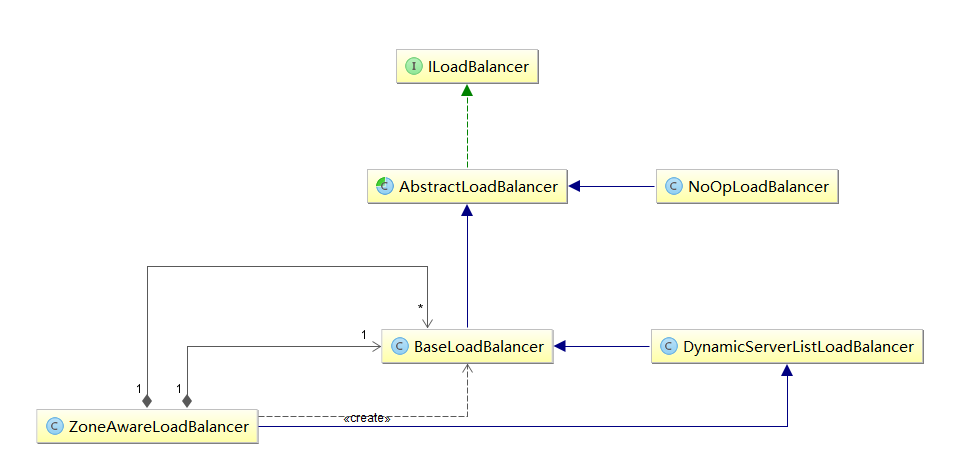
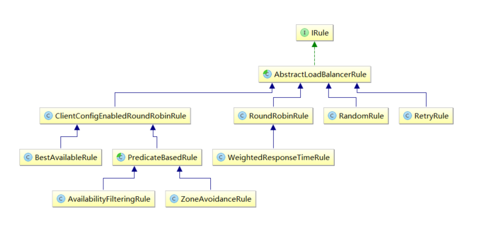

### 深入理解Ribbon
#### Ribbon的使用脉络
```
/**
 * Annotation to mark a RestTemplate bean to be configured to use a LoadBalancerClient
 * @author Spencer Gibb
 */
@Target({ ElementType.FIELD, ElementType.PARAMETER, ElementType.METHOD })
@Retention(RetentionPolicy.RUNTIME)
@Documented
@Inherited
@Qualifier
public @interface LoadBalanced {
}
```
从@LoadBalanced注解源码的注释中，我们可以知道该注解用来给RestTemplate标记，以使用负载均衡的客户端（LoadBalancerClient）来配置它。

通过搜索LoadBalancerClient，我们可以发现这是Spring Cloud中定义的一个接口：
```
public interface LoadBalancerClient {

    ServiceInstance choose(String serviceId);

    <T> T execute(String serviceId, LoadBalancerRequest<T> request) throws IOException;

    URI reconstructURI(ServiceInstance instance, URI original);

}
```
从该接口中，我们可以通过定义的抽象方法来了解到客户端负载均衡器中应具备的几种能力：
- ServiceInstance choose(String serviceId)：根据传入的服务名serviceId，从负载均衡器中挑选一个对应服务的实例。
- T execute(String serviceId, LoadBalancerRequest request) throws IOException：使用从负载均衡器中挑选出的服务实例来执行请求内容。
- URI reconstructURI(ServiceInstance instance, URI original)：为系统构建一个合适的“host:port”形式的URI。在分布式系统中，我们使用逻辑上的服务名称作为host来构建URI（替代服务实例的“host:port”形式）进行请求，比如：http://myservice/path/to/service 在该操作的定义中，前者ServiceInstance对象是带有host和port的具体服务实例，而后者URI对象则是使用逻辑服务名定义为host的URI，而返回的URI内容则是通过ServiceInstance的服务实例详情拼接出的具体“host:post”形式的请求地址。

从LoadBalancerAutoConfiguration类头上的注解可以知道Ribbon实现的负载均衡自动化配置需要满足下面两个条件：
- @ConditionalOnClass(RestTemplate.class)：RestTemplate类必须存在于当前工程的环境中。
- @ConditionalOnBean(LoadBalancerClient.class)：在Spring的Bean工程中有必须有LoadBalancerClient的实现Bean。

在该自动化配置类中，主要做了下面三件事：
```
- 创建了一个LoadBalancerInterceptor的Bean，用于实现对客户端发起请求时进行拦截，以实现客户端负载均衡。
- 创建了一个RestTemplateCustomizer的Bean，用于给RestTemplate增加LoadBalancerInterceptor拦截器。
- 维护了一个被@LoadBalanced注解修饰的RestTemplate对象列表，并在这里进行初始化，通过调用RestTemplateCustomizer的实例来给需要客户端负载均衡的RestTemplate增加LoadBalancerInterceptor拦截器。
```

接下来，我们看看LoadBalancerInterceptor拦截器是如何将一个普通的RestTemplate变成客户端负载均衡的：
```
public class LoadBalancerInterceptor implements ClientHttpRequestInterceptor {

    private LoadBalancerClient loadBalancer;

    public LoadBalancerInterceptor(LoadBalancerClient loadBalancer) {
        this.loadBalancer = loadBalancer;
    }

    @Override
    public ClientHttpResponse intercept(final HttpRequest request, final byte[] body,
            final ClientHttpRequestExecution execution) throws IOException {
        final URI originalUri = request.getURI();
        String serviceName = originalUri.getHost();
        return this.loadBalancer.execute(serviceName,
                new LoadBalancerRequest<ClientHttpResponse>() {
                    @Override
                    public ClientHttpResponse apply(final ServiceInstance instance)
                            throws Exception {
                        HttpRequest serviceRequest = new ServiceRequestWrapper(request,
                                instance);
                        return execution.execute(serviceRequest, body);
                    }
                });
    }

    private class ServiceRequestWrapper extends HttpRequestWrapper {

        private final ServiceInstance instance;

        public ServiceRequestWrapper(HttpRequest request, ServiceInstance instance) {
            super(request);
            this.instance = instance;
        }

        @Override
        public URI getURI() {
            URI uri = LoadBalancerInterceptor.this.loadBalancer.reconstructURI(
                    this.instance, getRequest().getURI());
            return uri;
        }
    }
}
```
当一个被@LoadBalanced注解修饰的RestTemplate对象向外发起HTTP请求时，会被LoadBalancerInterceptor类的intercept函数所拦截。由于我们在使用RestTemplate时候采用了服务名作为host，所以直接从HttpRequest的URI对象中通过getHost()就可以拿到服务名，然后调用execute函数去根据服务名来选择实例并发起实际的请求。

RibbonLoadBalancerClient是LoadBalancerClient接口的具体实现类：
```
public <T> T execute(String serviceId, LoadBalancerRequest<T> request) throws IOException {
    ILoadBalancer loadBalancer = getLoadBalancer(serviceId);
    Server server = getServer(loadBalancer);
    if (server == null) {
        throw new IllegalStateException("No instances available for " + serviceId);
    }
    RibbonServer ribbonServer = new RibbonServer(serviceId, server, isSecure(server,
            serviceId), serverIntrospector(serviceId).getMetadata(server));

    RibbonLoadBalancerContext context = this.clientFactory
            .getLoadBalancerContext(serviceId);
    RibbonStatsRecorder statsRecorder = new RibbonStatsRecorder(context, server);

    try {
        T returnVal = request.apply(ribbonServer);
        statsRecorder.recordStats(returnVal);
        return returnVal;
    }
    catch (IOException ex) {
        statsRecorder.recordStats(ex);
        throw ex;
    }
    catch (Exception ex) {
        statsRecorder.recordStats(ex);
        ReflectionUtils.rethrowRuntimeException(ex);
    }
    return null;
}
```
可以看到，在execute函数的实现中，第一步做的就是通过getServer根据传入的服务名serviceId去获得具体的服务实例：
```
protected Server getServer(ILoadBalancer loadBalancer) {
    if (loadBalancer == null) {
        return null;
    }
    return loadBalancer.chooseServer("default");
}
```
通过getServer函数的实现源码，我们可以看到这里获取具体服务实例的时候并没有使用LoadBalancerClient接口中的choose函数，而是使用了ribbon自身的ILoadBalancer接口中定义的chooseServer函数。
```
public interface ILoadBalancer {

    public void addServers(List<Server> newServers);

    public Server chooseServer(Object key);

    public void markServerDown(Server server);

    public List<Server> getReachableServers();

    public List<Server> getAllServers();
}
```
- addServers：向负载均衡器中维护的实例列表增加服务实例。
- chooseServer：通过某种策略，从负载均衡器中挑选出一个具体的服务实例。
- markServerDown：用来通知和标识负载均衡器中某个具体实例已经停止服务，不然负载均衡器在下一次获取服务实例清单前都会认为服务实例均是正常服务的。
- getReachableServers：获取当前正常服务的实例列表。
- getAllServers：获取所有已知的服务实例列表，包括正常服务和停止服务的实例。


而对于该接口的实现，我们可以整理出如上图所示的结构。我们可以看到BaseLoadBalancer类实现了基础的负载均衡，而DynamicServerListLoadBalancer和ZoneAwareLoadBalancer在负载均衡的策略上做了一些功能的扩展。
通过RibbonClientConfiguration配置类，可以知道在整合时默认采用了ZoneAwareLoadBalancer来实现负载均衡器。
```
@Bean
@ConditionalOnMissingBean
public ILoadBalancer ribbonLoadBalancer(IClientConfig config,
        ServerList<Server> serverList, ServerListFilter<Server> serverListFilter,
        IRule rule, IPing ping) {
    ZoneAwareLoadBalancer<Server> balancer = LoadBalancerBuilder.newBuilder()
            .withClientConfig(config).withRule(rule).withPing(ping)
            .withServerListFilter(serverListFilter).withDynamicServerList(serverList)
            .buildDynamicServerListLoadBalancer();
    return balancer;
}
```
我们再回到RibbonLoadBalancerClient的execute函数逻辑，在通过ZoneAwareLoadBalancer的chooseServer函数获取了负载均衡策略分配到的服务实例对象Server之后，将其内容包装成RibbonServer对象（该对象除了存储了服务实例的信息之外，还增加了服务名serviceId、是否需要使用HTTPS等其他信息），然后使用该对象再回调LoadBalancerInterceptor请求拦截器中LoadBalancerRequest的apply(final ServiceInstance instance)函数，向一个实际的具体服务实例发起请求，从而实现一开始以服务名为host的URI请求，到实际访问host:post形式的具体地址的转换。

分析到这里，我们已经可以大致理清Spring Cloud中使用Ribbon实现客户端负载均衡的基本脉络。了解了它是如何通过LoadBalancerInterceptor拦截器对RestTemplate的请求进行拦截，并利用Spring Cloud的负载均衡器LoadBalancerClient将以逻辑服务名为host的URI转换成具体的服务实例的过程。同时通过分析LoadBalancerClient的Ribbon实现RibbonLoadBalancerClient，可以知道在使用Ribbon实现负载均衡器的时候，实际使用的还是Ribbon中定义的ILoadBalancer接口的实现，自动化配置会采用ZoneAwareLoadBalancer的实例来进行客户端负载均衡实现。

#### 负载均衡器
通过之前的分析，我们已经对Spring Cloud如何使用Ribbon有了基本的了解。虽然Spring Cloud中定义了LoadBalancerClient为负载均衡器的接口，并且针对Ribbon实现了RibbonLoadBalancerClient，但是它在具体实现客户端负载均衡时，则是通过Ribbon的ILoadBalancer接口实现。在上一节分析时候，我们对该接口的实现结构已经做了一些简单的介绍，下面我们根据ILoadBalancer接口的实现类逐个看看它都是如何实现客户端负载均衡的。

##### AbstractLoadBalancer
AbstractLoadBalancer是ILoadBalancer接口的抽象实现。在该抽象类中定义了一个关于服务实例的分组枚举类ServerGroup，它包含了三种不同类型：ALL-所有服务实例、STATUS_UP-正常服务的实例、STATUS_NOT_UP-停止服务的实例；实现了一个chooseServer()函数，该函数通过调用接口中的chooseServer(Object key)实现，其中参数key为null，表示在选择具体服务实例时忽略key的条件判断；最后还定义了两个抽象函数，getServerList(ServerGroup serverGroup)定义了根据分组类型来获取不同的服务实例列表，getLoadBalancerStats()定义了获取LoadBalancerStats对象的方法，LoadBalancerStats对象被用来存储负载均衡器中各个服务实例当前的属性和统计信息，这些信息非常有用，我们可以利用这些信息来观察负载均衡器的运行情况，同时这些信息也是用来制定负载均衡策略的重要依据。
```
public abstract class AbstractLoadBalancer implements ILoadBalancer {

    public enum ServerGroup{
        ALL,
        STATUS_UP,
        STATUS_NOT_UP
    }

    public Server chooseServer() {
        return chooseServer(null);
    }

    public abstract List<Server> getServerList(ServerGroup serverGroup);

    public abstract LoadBalancerStats getLoadBalancerStats();
}
```
##### BaseLoadBalancer
BaseLoadBalancer类是Ribbon负载均衡器的基础实现类，在该类中定义很多关于均衡负载器相关的基础内容：
- 定义并维护了两个存储服务实例Server对象的列表。一个用于存储所有服务实例的清单，一个用于存储正常服务的实例清单。
```
@Monitor(name = PREFIX + "AllServerList", type = DataSourceType.INFORMATIONAL)
protected volatile List<Server> allServerList = Collections
        .synchronizedList(new ArrayList<Server>());
@Monitor(name = PREFIX + "UpServerList", type = DataSourceType.INFORMATIONAL)
protected volatile List<Server> upServerList = Collections
        .synchronizedList(new ArrayList<Server>());
```
- 定义了之前我们提到的用来存储负载均衡器各服务实例属性和统计信息的LoadBalancerStats对象。
- 定义了检查服务实例是否正常服务的IPing对象，在BaseLoadBalancer中默认为null，需要在构造时注入它的具体实现。
- 定义了检查服务实例操作的执行策略对象IPingStrategy，在BaseLoadBalancer中默认使用了该类中定义的静态内部类SerialPingStrategy实现。根据源码，我们可以看到该策略采用线性遍历ping服务实例的方式实现检查。该策略在当我们实现的IPing速度不理想，或是Server列表过大时，可能变的不是很为理想，这时候我们需要通过实现IPingStrategy接口并实现pingServers(IPing ping, Server[] servers)函数去扩展ping的执行策略。
```
private static class SerialPingStrategy implements IPingStrategy {
    @Override
    public boolean[] pingServers(IPing ping, Server[] servers) {
        int numCandidates = servers.length;
        boolean[] results = new boolean[numCandidates];

        if (logger.isDebugEnabled()) {
            logger.debug("LoadBalancer:  PingTask executing ["
                         + numCandidates + "] servers configured");
        }

        for (int i = 0; i < numCandidates; i++) {
            results[i] = false;
            try {
                if (ping != null) {
                    results[i] = ping.isAlive(servers[i]);
                }
            } catch (Throwable t) {
                logger.error("Exception while pinging Server:"
                             + servers[i], t);
            }
        }
        return results;
    }
}
```
- 定义了负载均衡的处理规则IRule对象，从BaseLoadBalancer中chooseServer(Object key)的实现源码，我们可以知道负载均衡器实际进行服务实例选择任务是委托给了IRule实例中的choose函数来实现。而在这里，默认初始化了RoundRobinRule为IRule的实现对象。RoundRobinRule实现了最基本且常用的线性负载均衡规则。
```
public Server chooseServer(Object key) {
    if (counter == null) {
        counter = createCounter();
    }
    counter.increment();
    if (rule == null) {
        return null;
    } else {
        try {
            return rule.choose(key);
        } catch (Throwable t) {
            return null;
        }
    }
}
```
- 启动ping任务：在BaseLoadBalancer的默认构造函数中，会直接启动一个用于定时检查Server是否健康的任务。该任务默认的执行间隔为：10秒。
- 实现了ILoadBalancer接口定义的负载均衡器应具备的一系列基本操作：
    - addServers(List newServers)：向负载均衡器中增加新的服务实例列表，该实现将原本已经维护着的所有服务实例清单allServerList和新传入的服务实例清单newServers都加入到newList中，然后通过调用setServersList函数对newList进行处理，在BaseLoadBalancer中实现的时候会使用新的列表覆盖旧的列表。而之后介绍的几个扩展实现类对于服务实例清单更新的优化都是对setServersList函数的重写来实现的。
    ```
    public void addServers(List<Server> newServers) {
        if (newServers != null && newServers.size() > 0) {
            try {
                ArrayList<Server> newList = new ArrayList<Server>();
                newList.addAll(allServerList);
                newList.addAll(newServers);
                setServersList(newList);
            } catch (Exception e) {
                logger.error("Exception while adding Servers", e);
            }
        }
    }
    ```
    - chooseServer(Object key)：挑选一个具体的服务实例，在上面介绍IRule的时候，已经做了说明，这里不再赘述。
    - markServerDown(Server server)：标记某个服务实例暂停服务。
    ```
    public void markServerDown(Server server) {
        if (server == null) {
            return;
        }
        if (!server.isAlive()) {
            return;
        }
        logger.error("LoadBalancer:  markServerDown called on ["
                + server.getId() + "]");
        server.setAlive(false);
        notifyServerStatusChangeListener(singleton(server));
    }
    ```
    - getReachableServers()：获取可用的服务实例列表。由于BaseLoadBalancer中单独维护了一个正常服务的实例清单，所以直接返回即可。
    ```
    public List<Server> getReachableServers() {
        return Collections.unmodifiableList(upServerList);
    }
    ```
    - getAllServers()：获取所有的服务实例列表。由于BaseLoadBalancer中单独维护了一个所有服务的实例清单，所以也直接返回它即可。
    ```
    public List<Server> getAllServers() {
        return Collections.unmodifiableList(allServerList);
    }
    ```
##### DynamicServerListLoadBalancer
DynamicServerListLoadBalancer类继承于BaseLoadBalancer类，它是对基础负载均衡器的扩展。在该负载均衡器中，实现了服务实例清单的在运行期的动态更新能力；同时，它还具备了对服务实例清单的过滤功能，也就是说我们可以通过过滤器来选择性的获取一批服务实例清单。下面我们具体来看看在该类中增加了一些什么内容：

##### ZoneAwareLoadBalancer
ZoneAwareLoadBalancer负载均衡器是对DynamicServerListLoadBalancer的扩展。在DynamicServerListLoadBalancer中，我们可以看到它并没有重写选择具体服务实例的chooseServer函数，所以它依然会采用在BaseLoadBalancer中实现的算法，使用RoundRobinRule规则，以线性轮询的方式来选择调用的服务实例，该算法实现简单并没有区域（Zone）的概念，所以它会把所有实例视为一个Zone下的节点来看待，这样就会周期性的产生跨区域（Zone）访问的情况，由于跨区域会产生更高的延迟，这些实例主要以防止区域性故障实现高可用为目的而不能作为常规访问的实例，所以在多区域部署的情况下会有一定的性能问题，而该负载均衡器则可以避免这样的问题。那么它是如何实现的呢？

首先，在ZoneAwareLoadBalancer中，我们可以发现，它并没有重写setServersList，说明实现服务实例清单的更新主逻辑没有修改。但是我们可以发现它重写了这个函数：setServerListForZones(Map<String, List<Server>> zoneServersMap)。看到这里可能会有一些陌生，因为它并不是接口中定义的必备函数，所以我们不妨去父类DynamicServerListLoadBalancer中寻找一下该函数，我们可以找到下面的定义了：
```
public void setServersList(List lsrv) {
    super.setServersList(lsrv);
    List<T> serverList = (List<T>) lsrv;
    Map<String, List<Server>> serversInZones = new HashMap<String, List<Server>>();
    ...
    setServerListForZones(serversInZones);
}

protected void setServerListForZones(Map<String, List<Server>> zoneServersMap) {
    LOGGER.debug("Setting server list for zones: {}", zoneServersMap);
    getLoadBalancerStats().updateZoneServerMapping(zoneServersMap);
}
```
setServerListForZones函数的调用位于更新服务实例清单函数setServersList的最后，同时从其实现内容来看，它在父类DynamicServerListLoadBalancer中的作用是根据按区域Zone分组的实例列表，为负载均衡器中的LoadBalancerStats对象创建ZoneStats并放入Map zoneStatsMap集合中，每一个区域Zone会对应一个ZoneStats，它用于存储每个Zone的一些状态和统计信息。
在ZoneAwareLoadBalancer中对setServerListForZones的重写如下：
```
protected void setServerListForZones(Map<String, List<Server>> zoneServersMap) {
    super.setServerListForZones(zoneServersMap);
    if (balancers == null) {
        balancers = new ConcurrentHashMap<String, BaseLoadBalancer>();
    }
    for (Map.Entry<String, List<Server>> entry: zoneServersMap.entrySet()) {
        String zone = entry.getKey().toLowerCase();
        getLoadBalancer(zone).setServersList(entry.getValue());
    }
    for (Map.Entry<String, BaseLoadBalancer> existingLBEntry: balancers.entrySet()) {
        if (!zoneServersMap.keySet().contains(existingLBEntry.getKey())) {
            existingLBEntry.getValue().setServersList(Collections.emptyList());
        }
    }
}
```
可以看到，在该实现中创建了一个ConcurrentHashMap()类型的balancers对象，它将用来存储每个Zone区域对应的负载均衡器，而具体的负载均衡器的创建则是通过下面的第一个循环中调用getLoadBalancer函数来完成，同时在创建负载均衡器的时候会创建它的规则（如果当前实现中没有IRULE的实例，就创建一个AvailabilityFilteringRule规则；如果已经有具体实例，就clone一个），在创建完负载均衡器后又马上调用setServersList函数为其设置对应Zone区域的实例清单。而第二个循环则是对Zone区域中实例清单的检查，看看是否有Zone区域下已经没有实例了，是的话就将balancers中对应Zone区域的实例列表清空，该操作的作用是为了后续选择节点时，防止过时的Zone区域统计信息干扰具体实例的选择算法。
在了解了该负载均衡器是如何扩展服务实例清单的实现后，我们来具体看看它是如何挑选服务实例，来实现对区域的识别的：
```
public Server chooseServer(Object key) {
    if (!ENABLED.get() || getLoadBalancerStats().getAvailableZones().size() <= 1) {
        logger.debug("Zone aware logic disabled or there is only one zone");
        return super.chooseServer(key);
    }
    Server server = null;
    try {
        LoadBalancerStats lbStats = getLoadBalancerStats();
        Map<String, ZoneSnapshot> zoneSnapshot = ZoneAvoidanceRule.createSnapshot(lbStats);
        logger.debug("Zone snapshots: {}", zoneSnapshot);
        ...
        Set<String> availableZones = ZoneAvoidanceRule.getAvailableZones(zoneSnapshot, triggeringLoad.get(), triggeringBlackoutPercentage.get());
        logger.debug("Available zones: {}", availableZones);
        if (availableZones != null &&  availableZones.size() < zoneSnapshot.keySet().size()) {
            String zone = ZoneAvoidanceRule.randomChooseZone(zoneSnapshot, availableZones);
            logger.debug("Zone chosen: {}", zone);
            if (zone != null) {
                BaseLoadBalancer zoneLoadBalancer = getLoadBalancer(zone);
                server = zoneLoadBalancer.chooseServer(key);
            }
        }
    } catch (Throwable e) {
        logger.error("Unexpected exception when choosing server using zone aware logic", e);
    }
    if (server != null) {
        return server;
    } else {
        logger.debug("Zone avoidance logic is not invoked.");
        return super.chooseServer(key);
    }
}
```
从源码中我们可以看到，只有当负载均衡器中维护的实例所属Zone区域个数大于1的时候才会执行这里的选择策略，否则还是将使用父类的实现。当Zone区域个数大于1个的时候，它的实现步骤主要如下：

- 调用ZoneAvoidanceRule中的静态方法createSnapshot(lbStats)，为当前负载均衡器中所有的Zone区域分别创建快照，保存在Map zoneSnapshot中，这些快照中的数据将用于后续的算法。
- 调用ZoneAvoidanceRule中的静态方法getAvailableZones(zoneSnapshot, triggeringLoad.get(), triggeringBlackoutPercentage.get())，来获取可用的Zone区域集合，在该函数中会通过Zone区域快照中的统计数据来实现可用区的挑选。
    - 首先它会剔除符合这些规则的Zone区域：所属实例数为零的Zone区域；Zone区域内实例平均负载小于零，或者实例故障率（断路器断开次数/实例数）大于等于阈值（默认为0.99999）。
    - 然后根据Zone区域的实例平均负载来计算出最差的Zone区域，这里的最差指的是实例平均负载最高的Zone区域。
    - 如果在上面的过程中没有符合剔除要求的区域，同时实例最大平均负载小于阈值（默认为20%），就直接返回所有Zone区域为可用区域。否则，从最坏Zone区域集合中随机的选择一个，将它从可用Zone区域集合中剔除。
- 当获得的可用Zone区域集合不为空，并且个数小于Zone区域总数，就随机的选择一个Zone区域。
- 在确定了某个Zone区域后，则获取对应Zone区域的服务均衡器，并调用chooseServer来选择具体的服务实例，而在chooseServer中将使用IRule接口的choose函数来选择具体的服务实例。在这里IRule接口的实现会使用ZoneAvoidanceRule来挑选出具体的服务实例。

#### 负载均衡策略


#### Ribbon工作时会做四件事情：
 1. 优先选择在同一个Zone且负载较少的Eureka Server；
 2. 定期从Eureka更新并过滤服务实例列表；
 3. 根据用户指定的策略，在从Server取到的服务注册列表中选择一个实例的地址；
 4. 通过RestClient进行服务调用。