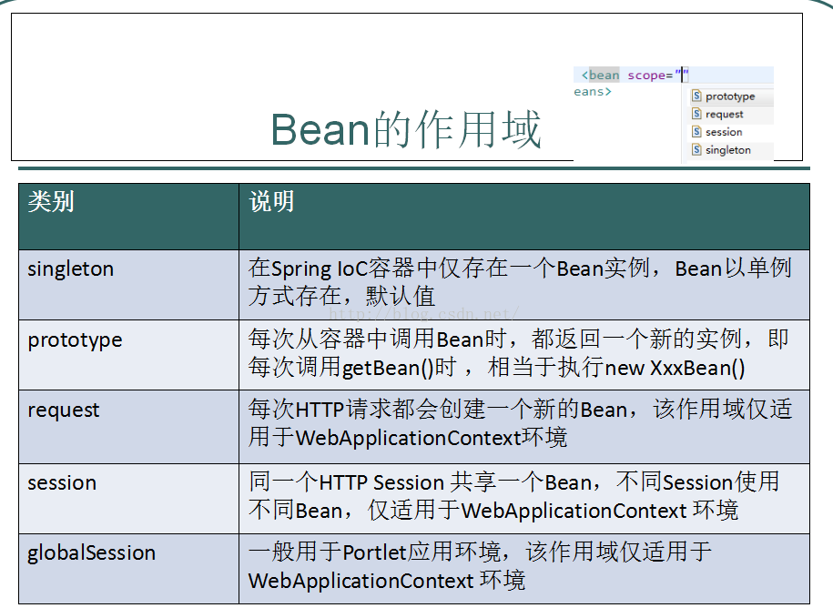
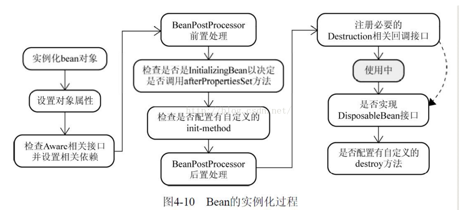

### Bean的作用域和生命周期  

在Spring中，那些组成应用程序的主体及由Spring IoC容器所管理的对象，被称之为bean。简单地讲，bean就是由IoC容器初始化、装配及管理的对象，除此之外，bean就与应用程序中的其他对象没有什么区别了。而bean的定义以及bean相互间的依赖关系将通过配置元数据来描述。  

Spring中的bean默认都是单例的，这些单例Bean在多线程程序下如何保证线程安全呢？例如对于Web应用来说，Web容器对于每个用户请求都创建一个单独的Sevlet线程来处理请求，引入Spring框架之后，每个Action都是单例的，那么对于Spring托管的单例Service Bean，如何保证其安全呢？ Spring的单例是基于BeanFactory也就是Spring容器的，单例Bean在此容器内只有一个，Java的单例是基于JVM，每个JVM内只有一个实例。  

#### Bean的作用域  
创建一个bean定义，其实质是用该bean定义对应的类来创建真正实例的“配方”。把bean定义看成一个配方很有意义，它与class很类似，只根据一张“处方”就可以创建多个实例。不仅可以控制注入到对象中的各种依赖和配置值，还可以控制该对象的作用域。这样可以灵活选择所建对象的作用域，而不必在Java Class级定义作用域。Spring Framework支持五种作用域，分别阐述如下表。  
  

五种作用域中，request、session和global session三种作用域仅在基于web的应用中使用（不必关心你所采用的是什么web应用框架），只能用在基于web的Spring ApplicationContext环境。  

(1)当一个bean的作用域为Singleton，那么Spring IoC容器中只会存在一个共享的bean实例，并且所有对bean的请求，只要id与该bean定义相匹配，则只会返回bean的同一实例。Singleton是单例类型，就是在创建起容器时就同时自动创建了一个bean的对象，不管你是否使用，他都存在了，每次获取到的对象都是同一个对象。注意，Singleton作用域是Spring中的缺省作用域。要在XML中将bean定义成singleton，可以这样配置：  
```
<bean id="ServiceImpl" class="cn.csdn.service.ServiceImpl" scope="singleton">
```  

(2)当一个bean的作用域为Prototype，表示一个bean定义对应多个对象实例。Prototype作用域的bean会导致在每次对该bean请求（将其注入到另一个bean中，或者以程序的方式调用容器的getBean()方法）时都会创建一个新的bean实例。Prototype是原型类型，它在我们创建容器的时候并没有实例化，而是当我们获取bean的时候才会去创建一个对象，而且我们每次获取到的对象都不是同一个对象。根据经验，对有状态的bean应该使用prototype作用域，而对无状态的bean则应该使用singleton作用域。在XML中将bean定义成prototype，可以这样配置：  
```
<bean id="account" class="com.foo.DefaultAccount" scope="prototype"/>  
 或者
<bean id="account" class="com.foo.DefaultAccount" singleton="false"/> 
```  

(3)当一个bean的作用域为Request，表示在一次HTTP请求中，一个bean定义对应一个实例；即每个HTTP请求都会有各自的bean实例，它们依据某个bean定义创建而成。该作用域仅在基于web的Spring ApplicationContext情形下有效。考虑下面bean定义：  
```
<bean id="loginAction" class=cn.csdn.LoginAction" scope="request"/>
```  

针对每次HTTP请求，Spring容器会根据loginAction bean的定义创建一个全新的LoginAction bean实例，且该loginAction bean实例仅在当前HTTP request内有效，因此可以根据需要放心的更改所建实例的内部状态，而其他请求中根据loginAction bean定义创建的实例，将不会看到这些特定于某个请求的状态变化。当处理请求结束，request作用域的bean实例将被销毁。  

(4)当一个bean的作用域为Session，表示在一个HTTP Session中，一个bean定义对应一个实例。该作用域仅在基于web的Spring ApplicationContext情形下有效。考虑下面bean定义：  
```
<bean id="userPreferences" class="com.foo.UserPreferences" scope="session"/>
```  

针对某个HTTP Session，Spring容器会根据userPreferences bean定义创建一个全新的userPreferences bean实例，且该userPreferences bean仅在当前HTTP Session内有效。与request作用域一样，可以根据需要放心的更改所创建实例的内部状态，而别的HTTP Session中根据userPreferences创建的实例，将不会看到这些特定于某个HTTP Session的状态变化。当HTTP Session最终被废弃的时候，在该HTTP Session作用域内的bean也会被废弃掉。  

(5)当一个bean的作用域为Global Session，表示在一个全局的HTTP Session中，一个bean定义对应一个实例。典型情况下，仅在使用portlet context的时候有效。该作用域仅在基于web的Spring ApplicationContext情形下有效。考虑下面bean定义：  
```
<bean id="user" class="com.foo.Preferences "scope="globalSession"/>
```  

global session作用域类似于标准的HTTP Session作用域，不过仅仅在基于portlet的web应用中才有意义。Portlet规范定义了全局Session的概念，它被所有构成某个portlet web应用的各种不同的portlet所共享。在global session作用域中定义的bean被限定于全局portlet Session的生命周期范围内。  

#### Bean的生命周期  
Spring中bean的实例化过程：  
  

与上图类似，bean的生命周期流程图：  
  

Bean实例生命周期的执行过程如下：  

- Spring对bean进行实例化，默认bean是单例；

- Spring对bean进行依赖注入；

- 如果bean实现了BeanNameAware接口，spring将bean的id传给setBeanName()方法；

- 如果bean实现了BeanFactoryAware接口，spring将调用setBeanFactory方法，将BeanFactory实例传进来；

- 如果bean实现了ApplicationContextAware接口，它的setApplicationContext()方法将被调用，将应用上下文的引用传入到bean中；

- 如果bean实现了BeanPostProcessor接口，它的postProcessBeforeInitialization方法将被调用；

- 如果bean实现了InitializingBean接口，spring将调用它的afterPropertiesSet接口方法，类似的如果bean使用了init-method属性声明了初始化方法，该方法也会被调用；

- 如果bean实现了BeanPostProcessor接口，它的postProcessAfterInitialization接口方法将被调用；

- 此时bean已经准备就绪，可以被应用程序使用了，他们将一直驻留在应用上下文中，直到该应用上下文被销毁；

- 若bean实现了DisposableBean接口，spring将调用它的distroy()接口方法。同样的，如果bean使用了destroy-method属性声明了销毁方法，则该方法被调用；  

如果bean的scope设为prototype时，当容器关闭时，destroy方法不会被调用。对于prototype作用域的bean，有一点非常重要，那就是Spring不能对一个prototype bean的整个生命周期负责：容器在初始化、配置、装饰或者是装配完一个prototype实例后，将它交给客户端，随后就对该prototype实例不闻不问了。不管何种作用域，容器都会调用所有对象的初始化生命周期回调方法。但对prototype而言，任何配置好的析构生命周期回调方法都将不会被调用。清除prototype作用域的对象并释放任何prototype bean所持有的昂贵资源，都是客户端代码的职责（让Spring容器释放被prototype作用域bean占用资源的一种可行方式是，通过使用bean的后置处理器，该处理器持有要被清除的bean的引用）。谈及prototype作用域的bean时，在某些方面你可以将Spring容器的角色看作是Java new操作的替代者，任何迟于该时间点的生命周期事宜都得交由客户端来处理。  

Spring容器可以管理singleton作用域下bean的生命周期，在此作用域下，Spring能够精确地知道bean何时被创建，何时初始化完成，以及何时被销毁。而对于prototype作用域的bean，Spring只负责创建，当容器创建了bean的实例后，bean的实例就交给了客户端的代码管理，Spring容器将不再跟踪其生命周期，并且不会管理那些被配置成prototype作用域的bean的生命周期。  