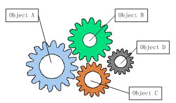

### 控制反转（IoC）与依赖注入（DI）  

#### 什么是控制反转  
传统软件系统中耦合的对象：  
  
从图中可以看到，软件中的对象就像齿轮一样，协同工作，但是互相耦合，一个零件不能正常工作，整个系统就崩溃了。这是一个强耦合的系统。齿轮组中齿轮之间的啮合关系,与软件系统中对象之间的耦合关系非常相似。对象之间的耦合关系是无法避免的，也是必要的，这是协同工作的基础。现在，伴随着工业级应用的规模越来越庞大，对象之间的依赖关系也越来越复杂，经常会出现对象之间的多重依赖性关系，因此，架构师和设计师对于系统的分析和设计，将面临更大的挑战。对象之间耦合度过高的系统，必然会出现牵一发而动全身的情形。  

为了解决对象间耦合度过高的问题，软件专家Michael Mattson提出了IOC理论，用来实现对象之间的“解耦”。  

控制反转（Inversion of Control）是一种是面向对象编程中的一种设计原则，用来减低计算机代码之间的耦合度。其基本思想是：借助于“第三方”实现具有依赖关系的对象之间的解耦。  
  
由于引进了中间位置的“第三方”，也就是IOC容器，使得A、B、C、D这4个对象没有了耦合关系，齿轮之间的传动全部依靠“第三方”了，全部对象的控制权全部上缴给“第三方”IOC容器，所以，IOC容器成了整个系统的关键核心，它起到了一种类似“粘合剂”的作用，把系统中的所有对象粘合在一起发挥作用，如果没有这个“粘合剂”，对象与对象之间会彼此失去联系，这就是有人把IOC容器比喻成“粘合剂”的由来。  

理解好Ioc的关键是要明确“谁控制谁，控制什么，为何是反转（有反转就应该有正转了），哪些方面反转了”，那我们来深入分析一下：  

- 谁控制谁，控制什么：传统Java SE程序设计，我们直接在对象内部通过new进行创建对象，是程序主动去创建依赖对象；而IoC是有专门一个容器来创建这些对象，即由Ioc容器来控制对 象的创建；谁控制谁？当然是IoC 容器控制了对象；控制什么？那就是主要控制了外部资源获取（不只是对象包括比如文件等）。  

- 为何是反转，哪些方面反转了：有反转就有正转，传统应用程序是由我们自己在对象中主动控制去直接获取依赖对象，也就是正转；而反转则是由容器来帮忙创建及注入依赖对象；为何是反转？因为由容器帮我们查找及注入依赖对象，对象只是被动的接受依赖对象，所以是反转；哪些方面反转了？依赖对象的获取被反转了。  

#### IoC能做什么  
IoC 不是一种技术，只是一种思想，一个重要的面向对象编程的法则，它能指导我们如何设计出松耦合、更优良的程序。传统应用程序都是由我们在类内部主动创建依赖对象，从而导致类与类之间高耦合，难于测试；有了IoC容器后，把创建和查找依赖对象的控制权交给了容器，由容器进行注入组合对象，所以对象与对象之间是 松散耦合，这样也方便测试，利于功能复用，更重要的是使得程序的整个体系结构变得非常灵活。  

其实IoC对编程带来的最大改变不是从代码上，而是从思想上，发生了“主从换位”的变化。应用程序原本是老大，要获取什么资源都是主动出击，但是在IoC/DI思想中，应用程序就变成被动的了，被动的等待IoC容器来创建并注入它所需要的资源了。  

IoC很好的体现了面向对象设计法则之一—— 好莱坞法则：“别找我们，我们找你”；即由IoC容器帮对象找相应的依赖对象并注入，而不是由对象主动去找。  

#### 什么是依赖注入  
依赖注入就是将实例变量传入到一个对象中去(Dependency injection means giving an object its instance variables)。 

DI—Dependency Injection，即“依赖注入”：组件之间依赖关系由容器在运行期决定，形象的说，即由容器动态的将某个依赖关系注入到组件之中。依赖注入的目的并非为软件系统带来更多功能，而是为了提升组件重用的频率，并为系统搭建一个灵活、可扩展的平台。通过依赖注入机制，我们只需要通过简单的配置，而无需任何代码就可指定目标需要的资源，完成自身的业务逻辑，而不需要关心具体的资源来自何处，由谁实现。  

理解DI的关键是：“谁依赖谁，为什么需要依赖，谁注入谁，注入了什么”，那我们来深入分析一下：

- 谁依赖于谁：当然是应用程序依赖于IoC容器；  
- 为什么需要依赖：应用程序需要IoC容器来提供对象需要的外部资源；  
- 谁注入谁：很明显是IoC容器注入应用程序某个对象，应用程序依赖的对象；  
- 注入了什么：就是注入某个对象所需要的外部资源（包括对象、资源、常量数据）。   

如果在 Class A 中，有 Class B 的实例，则称 Class A 对 Class B 有一个依赖。例如下面类 Human 中用到一个 Father 对象，我们就说类 Human 对类 Father 有一个依赖。  
```
public class Human {
    ...
    Father father;
    ...
    public Human() {
        father = new Father();
    }
}
```  
仔细看这段代码我们会发现存在一些问题：  

- 如果现在要改变 father 生成方式，如需要用new Father(String name)初始化 father，需要修改 Human 代码；
- 如果想测试不同 Father 对象对 Human 的影响很困难，因为 father 的初始化被写死在了 Human 的构造函数中；
- 如果new Father()过程非常缓慢，单测时我们希望用已经初始化好的 father 对象 Mock 掉这个过程也很困难。  

上面将依赖在构造函数中直接初始化是一种 Hard init 方式，弊端在于两个类不够独立，不方便测试。我们还有另外一种 Init 方式，如下：  
```
public class Human {
    ...
    Father father;
    ...
    public Human(Father father) {
        this.father = father;
    }
}
```  
上面代码中，我们将 father 对象作为构造函数的一个参数传入。在调用 Human 的构造方法之前外部就已经初始化好了 Father 对象。像这种非自己主动初始化依赖，而通过外部来传入依赖的方式，我们就称为依赖注入。
现在我们发现上面 1 中存在的两个问题都很好解决了，简单的说依赖注入主要有两个好处：  

- 解耦，将依赖之间解耦。
- 因为已经解耦，所以方便做单元测试，尤其是 Mock 测试。  

#### 控制反转和依赖注入的关系  
我们已经分别解释了控制反转和依赖注入的概念。有些人会把控制反转和依赖注入等同，但实际上它们有着本质上的不同。  

- 控制反转是一种思想  
- 依赖注入是一种设计模式  

IoC框架使用依赖注入作为实现控制反转的方式，但是控制反转还有其他的实现方式，例如说Service Locator，所以不能将控制反转和依赖注入等同。  

#### 参考资料  
- [依赖注入和控制反转的理解](https://blog.csdn.net/bestone0213/article/details/47424255)  
- [控制反转（IoC）与依赖注入（DI）](http://blog.xiaohansong.com/2015/10/21/IoC-and-DI/)